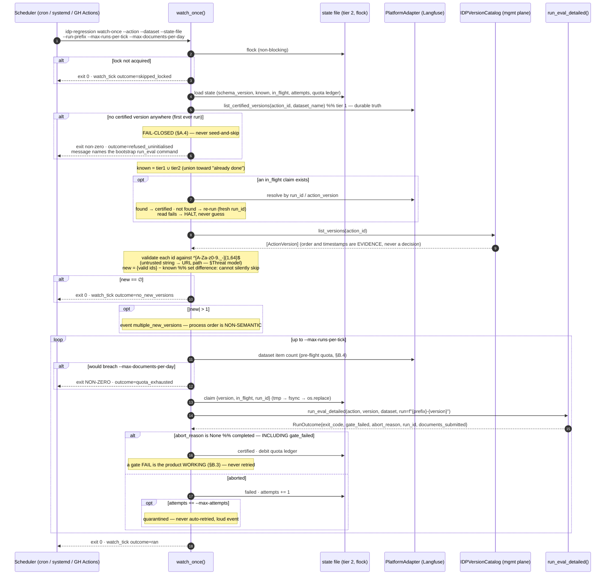
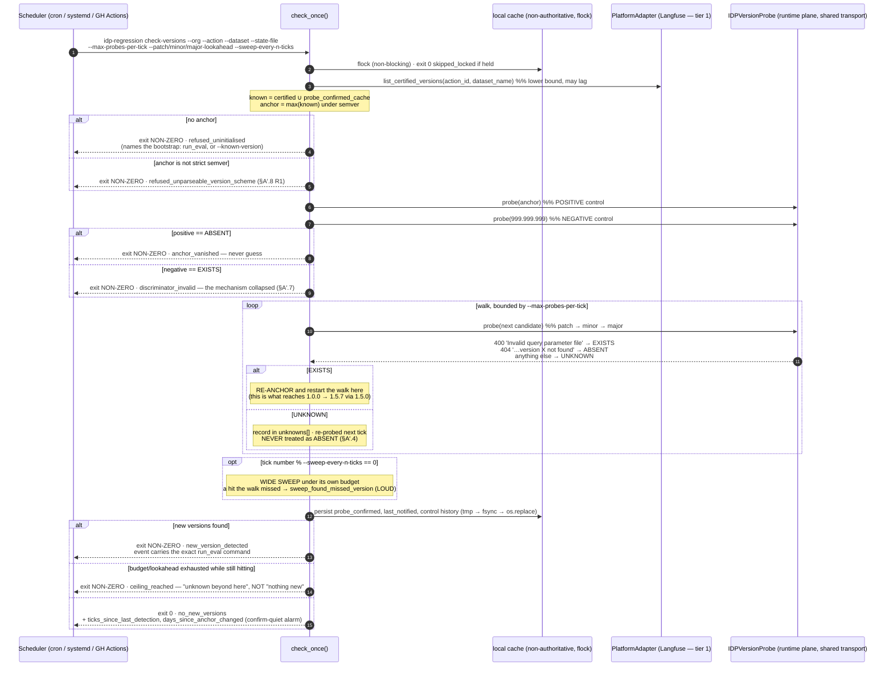

# ADR-0006: Version-change detection & unattended run triggering

**Status:** ✅ **DECISION A′ ACCEPTED (2026-09-23)** — version-change detection is **RE-OPENED** on new evidence and decided as **bounded existence probing** (§Decision A′). User decision 2026-09-23: *"we need to poll for changes."* **Decision A (2026-09-22) is superseded**, kept struck with its reasoning intact. **Decision B is PARTIALLY REVIVED** — its trigger shape (external scheduler, one-shot tick, `flock`) is the plan of record for the new `check-versions` command (§A′.10); its quota ledger, claim protocol, quarantine and `run_eval_detailed` seam stay **withdrawn** and return only with Phase 2 `--auto-run` (§A′.5). §B.4's per-run quota reasoning remains **promoted into ADR-0004 A10**. **Decision C is amended** — the S-01.4 `run_eval_detailed` delta stays withdrawn; **Dunga: still nothing owed against S-01.4 from this ADR.** **Read §Decision A′ first; everything under the struck §Decision A is preserved record, not a plan.**
**Date:** 2026-09-22
**Context (use case):** UC-01 (the run itself, unchanged) + a **new** use case, provisionally **UC-02 "unattended version watch"**, owed by Feliz. This ADR designs the capability; it does not write the use case.
**Risk:** High — this is the first component that can **spend IDP quota with no human in the loop** and the first that decides *on its own* what gets measured. Its failure modes are silence (looks healthy, certifies nothing) and runaway (certifies everything, burns the org's quota). Both are the "silently-wrong GREEN" family `CLAUDE.md ## Rigor` warns about. Atchim review: **REQUIRED** before implementation.

---

## Context

On 2026-09-22 the user stated the target architecture as a ten-step pipeline the custom app runs. Eight of the ten are already built or landing; two are genuinely absent. This ADR designs only the absent two.

| # | User's step | Status today |
|---|---|---|
| 1 | Run headless as a service | ❌ **absent** — one-shot CLI, four required flags (ADR-0004 A8) → **§Decision B** |
| 2 | Poll `GET /organizations/{orgId}/actions/{actionId}/versions` for a new published version | ❌ **absent** — no code calls it; the adapter knows only the executions path (`adapter/idp_client.py::_executions_base_url`, the **runtime** plane `idp-rt.{region}`) → **§Decision A** |
| 3 | Submit seed document(s) to the new version | ✅ `MuleSoftIDPAdapter.extract(path, action_id, version)` (ADR-0002) — the watcher supplies `version`, nothing else changes |
| 4 | Poll execution status until terminal | ✅ configurable terminal-status allowlist (ADR-0002, ASM-01) |
| 5 | Poll interval ≥ 10 s | 🔧 **landing now** in `adapter/idp_client.py` (interval floor). Not designed here. |
| 6 | Retrieve results with `?valueOnly=false` | 🔧 **landing now** in `adapter/idp_client.py`. Not designed here. **This was a live fail-shut defect**, not a cosmetic one: `normalize()` already requires the `{"value", "confidence"}` cell shape that only `valueOnly=false` returns, so every live extraction would have raised at the normalize boundary. |
| 7 | Fetch expected output from the Langfuse dataset | ✅ `PlatformAdapter.get_dataset` (ADR-0005) |
| 8 | Compare actual vs expected — per-field accuracy, version-over-version view | ✅ ours (`classifier/`) — **settled, see §Step 8** |
| 9 | Push per-field scores + gate to Langfuse | ✅ `record_run` (ADR-0005 #9) |
| 10 | Langfuse is the scoreboard / regression view | ✅ with two honest limits — **§Step 8** |

### Step 8 — where the comparison brain lives (settled 2026-09-22, recorded not re-opened)

**Langfuse stores the dataset and the scores and provides the cross-run view. The comparison itself is ours.** The nested walk, type-aware canonical matching, `match_key` list pairing and per-leaf scoring live in `classifier/` (ADR-0003) and are the CI gate (INV-08). This confirms ADR-0003/0005; it changes no code. It changes the *documentation*, because SPEC-01/UC-01/SEQ-UC-01 never said out loud which side of the seam owns the comparison, and a reader could reasonably have assumed the platform did it.

**Considered and deferred: Langfuse custom evaluators.** Langfuse supports a Python function receiving `input` / `output` / `expected_output` / `metadata` and returning `Evaluation` objects — an alternative *host* for the same custom logic. Rejected as the design, for two specific reasons, not as a general dislike:
1. It moves the pure classifier inside the platform's execution model. **INV-08 says the gate is computed in-process, before the platform write, and never inferred from what landed on the platform.** An evaluator that runs *on* Langfuse makes the platform the place the gate happens — a platform outage or an evaluator-runner bug becomes able to flip the CI signal, which is exactly what INV-08 exists to forbid.
2. It conflicts with **record-after (ADR-0005 #9)**: the orchestrator computes every gate first and writes once. A platform-hosted evaluator inverts that ordering by construction.

Keep it on the record as the alternative it is: if this product ever grows a *second*, non-gating scoring dimension (a drift metric, a human-review heuristic) that must NOT be able to affect the CI signal, a custom evaluator is the natural home for it precisely because it is outside the gate path.

**Two honest limits of "Langfuse is the regression view" (step 10):**
- **Per DEBT-18 option B, the view shows verdicts and gates, not values.** No extracted (actual), expected or confidence *value* is written to the platform. So "which field regressed, on which document, how" is answerable; "what did it extract instead" is not, from the platform alone. This is a deliberate compliance decision, not a gap.
- **Version-over-version comparison depends on run naming.** Each invocation is its own experiment (`f"{run_name}-{run_id[:8]}"`, DEBT-19/N26). For the Experiments tab to read as a *version series*, the run name must carry the version — see §Decision B, `--run-prefix`.

### Confidence (the one plausible amendment to DEBT-18 B)

The user's step-8 text mentions confidence. They were not asked to re-decide DEBT-18 and did not, **so option B stands**: no confidence value crosses to the platform. Flagged for a future decision: a **per-field confidence *score*** — a float on the existing `field:<name>` score, not the extracted value — is the one narrow amendment that is plausibly compatible with option B's intent (it reveals model certainty, not document contents). It is **not** designed here and **must not be implemented without an explicit user decision**, because a float derived per-field is still a per-field signal about a specific document, and whether that is "content" is the user's call, not the architect's.

### Preconditions — **resolved 2026-09-22: question 1 is answered NO, and the branch this ADR was written for is closed**

`S-01.6 / T-01.6.6` carried three discovery questions. Their status after `docs/spikes/PROBE-2026-09-22-idp-version-listing.md` (live probe + vendor documentation + the correction at its end):

| # | Question | Status |
|---|---|---|
| 1 | Does a management API list an action's versions? | ❌ **ANSWERED — NO, on any supported surface.** `OPTIONS` on the runtime plane returns `Allow: POST,OPTIONS`; the documented IDP REST API is **exactly two endpoints** (`POST …/executions`, `GET …/executions/{id}`); `anypoint…/idp/api/v1/…` 403s for both orgs and is the console's **undocumented, unsupported** backing API; and the connected app already holds the **only documented scope** (`Execute Published Actions`), so no grant would open a documented listing — because none exists. |
| 2 | Does submit support a floating/`latest` version? | ❌ **ANSWERED 2026-09-23 — NO.** `latest` and `LATEST` both 404 (`…version latest not found`), Addendum 3. This **kills option 1 outright**; §Decision A′ does not depend on it. |
| 3 | Do published versions carry a timestamp or monotonic ordering? | ⬜ **STILL MOOT under A′, for a new reason** — a membership oracle returns no metadata at all, so there is nothing to order and §A.2's refusal to trust external ordering is vindicated twice. Original note: **MOOT** — nothing lists them. §A.2 refused to depend on ordering anyway, which is the one design choice this outcome vindicates rather than invalidates. |

➡️ **Superseded 2026-09-23:** the conclusion below is still true — *no API lists versions* — but it is no longer decisive, because §Decision A′ detects without listing. Original text: **Consequence: the "listing exists" branch that §Decision A is written for is not available, and the ADR's own status changes accordingly.** Nothing in §Decision A is implementable, now or on the current evidence. Also unresolved and named in T-01.6.6: the **(a) regression gate vs (b) production monitoring** ambiguity. This ADR designs **(a)** only. **(b) is not this product** — there is no golden for an arbitrary production document, so the classifier has nothing to compare against.

---

## Threat model (new boundaries only)

The existing boundaries (IDP runtime plane, platform, local documents) are unchanged and covered by ADR-0002/0004/0005. Two are new.

**New boundary 1 — the IDP *management* plane (version listing).** A different host and a different API from the executions endpoint; its response is untrusted input.
- **Tampering / path injection (the finding worth naming).** A version id returned by the listing API flows **into a URL path** (`.../versions/{version}/executions`). Today `version` is human-supplied and validated at the CLI boundary against `^[A-Za-z0-9._-]{1,64}$` (ADR-0002). Under a watcher it is **machine-supplied from an external response** — the same class as `document_id` being golden-set content, which produced `path_containment_violation` (ADR-0004 A2). **Mitigation: the watcher applies the identical `^[A-Za-z0-9._-]{1,64}$` validation to every listed version id before it can reach a URL, and a version failing it is refused, logged (the id, sanitized) and never submitted.** A malformed id is never "skipped quietly".
- **Spoofing / elevation:** same OAuth client credentials. If the management plane requires a *different* scope or credential, that is a new Sensitive surface for Mestre to register — T-01.6.6 must report it.
- **Denial of wallet (the dominant threat, and new):** the listing response drives quota spend. A listing that returns 200 versions, or flaps, causes N×200 document extractions. **Mitigation: the quota ceiling of §Decision B is a hard precondition of this story, not an NFR to be waived** — `/signoff` blocker B-3 (N27, no quota ceiling, no config hook) is upgraded from Major-system-finding to **Done-blocker for this story**.
- **Information disclosure:** version ids and action ids are not secrets, but the listing response may carry author/description fields. Only the version id is retained; nothing else from the response is logged or persisted.

**New boundary 2 — the watcher's own persisted state.** A local file that decides whether quota is spent. Tampering with it (or losing it) causes re-runs or silent skips. Mitigations: atomic writes, an exclusive lock, and — load-bearing — **the local file is never the sole source of truth** (see §Decision A.3).

---

## Decision A′ — Version-change detection by **bounded existence probing** · ✅ **RE-OPENED AND DECIDED 2026-09-23**

> **A′ supersedes the withdrawal below.** The withdrawal is preserved, struck, and its reasoning is intact — it is the record of *why the cheap mechanism matters*, and every argument it made about silent failure now binds A′ rather than excusing it. **The withdrawal was correct on the evidence it had. The evidence changed on 2026-09-23** (`docs/spikes/PROBE-2026-09-22-idp-version-listing.md` **Addendum 3**), and the user decided plainly: *"2 — we need to poll for changes."* That decision is not re-litigated here. What follows is the best available mechanism and an honest statement of its limits.

### A′.0 What changed, in one paragraph

A `POST …/actions/{action}/versions/{v}/executions` with a **deliberately empty multipart body** returns **400 `Invalid query parameter 'file'`** when the version exists (routing succeeded, payload validation rejected) and **404 `…version {v} not found`** when it does not. No document is processed, so **zero extraction quota is spent**, and it uses only the **documented** endpoint under the scope the connected app already holds. This is strictly cheaper than the withdrawal's option 1 (one real extraction per tick) and strictly safer than option 3 (the undocumented console API). It also answers T-01.6.6 **q2**: **`latest` is NOT a supported floating tag** (404), which kills option 1 outright — A′ is not "option 1 made cheaper", it is a **fourth option that did not exist when A was withdrawn**.

**What it still does not give us, and this governs the whole design: it is an *existence check*, not an *enumeration*.** It answers *"does version X exist?"*, never *"what versions exist?"*. A detector must therefore **guess candidates**, and the failure mode of guessing wrong is a **false negative** — a watcher emitting healthy ticks while having detected nothing. That is the "silently-wrong GREEN" family `CLAUDE.md ## Rigor` names as the worst thing this system can produce. **Everything in §A′.3 exists because of that sentence.**

### A′.1 Adapter surface — an `IDPVersionProbe` Protocol, and why the A.1 justification changed

```python
class ProbeResult(StrEnum):
    EXISTS  = "exists"
    ABSENT  = "absent"
    UNKNOWN = "unknown"      # ← load-bearing. See §A′.4.

class IDPVersionProbe(Protocol):
    def probe(self, org_id: str, action_id: str, version: str) -> ProbeResult: ...
```

**The name changed because the capability changed.** `IDPVersionCatalog.list_versions()` is withdrawn and stays withdrawn — there is nothing to list, and keeping a "catalog" name over a membership oracle would be a lie in the type system. **Reviving a withdrawn interface verbatim would have been inheritance, not design.**

**The A.1 argument for a separate Protocol half-collapsed and is restated honestly.** A.1 justified separation on *"different planes — `idp-rt.{region}` runtime vs. the management host"*. **There is no management plane.** The probe hits the **same host, same path family, same OAuth credential** as `extract()`. Three of A.1's four grounds survive and are sufficient:

- **Different cost profile** — one metadata-ish round trip vs. N billable extractions.
- **Different failure semantics** — a probe failure means *"I don't know"*; an `extract()` failure means *"this run is not a reference"*. Putting the first inside ADR-0004's containment envelope for the second would make "don't know" indistinguishable from "aborted".
- **Different consumers** — only the detector probes; only the orchestrator extracts. Widening `IDPAdapter` would force every existing consumer and every test double to grow a method it never calls.

**Consequence of the shared plane, and it is a practical one: the probe MUST reuse `adapter/`'s existing transport — the token cache and the no-redirect opener — not build a second HTTP path.** A second opener is a second place a 3xx could re-send the Bearer token, which ADR-0002 closed once and must not be re-opened by a sibling. Same rules bind: typed errors from `errors.py`, **no raw exception escapes the probe**, no token/credential/URL in any message.

**A security finding from the withdrawn design is now DEAD, and that is an improvement worth naming.** The withdrawn threat model's headline was *"a version id returned by an external listing flows into a URL path"* — the `path_containment_violation` class. **Under A′ the version id is locally *generated* from a grammar we own, never *received* from an external response.** The regex `^[A-Za-z0-9._-]{1,64}$` survives as a **defence-in-depth assertion at the URL-build site** (a generator bug is still a bug), but the untrusted-input boundary is gone. A′ is materially safer than A on exactly the axis A was riskiest.

### A′.2 Candidate strategy — an **anchored semver walk with re-anchoring**, not a static grid

**Anchor.** The highest version we have *confirmed to exist* — `anchor = max(certified_versions ∪ probe_confirmed_cache)` under semver ordering. No anchor → **fail-closed** (§A′.6).

**Not a static grid.** A fixed next-patch / next-minor / next-major grid is what Addendum 3 warns about: `1.0.0 → 1.5.7` is missed and the tick still reports healthy. A **walk** does better for the same probe budget, by exploiting the one property a membership oracle has that a grid ignores — **a hit is information.**

**The walk, per tick, in this order:**

1. **Patch axis** from the anchor: `M.m.(p+1)`, `M.m.(p+2)`, … up to `--patch-lookahead`.
2. **Minor axis**: `M.(m+1).0`, `M.(m+2).0`, … up to `--minor-lookahead`.
3. **Major axis**: `(M+1).0.0`, … up to `--major-lookahead`.

**The rule that makes it a walk: every HIT re-anchors, and the walk restarts from the new anchor within the same tick**, subject to the total probe budget. So:

- `1.0.0 → 1.0.1 → 1.0.2 → 1.0.3` is followed as a **chain in one tick**, not three ticks.
- `1.0.0 → 1.5.7` **is reached** if `1.5.0` was ever published: minor-lookahead hits `1.5.0` → re-anchor → patch walk climbs `1.5.1 … 1.5.7`.

**So state the exact miss condition, rather than "it might miss":** the walk misses only when the true new version is unreachable from the anchor by a chain of hits — i.e. **the publisher skipped more than `--minor-lookahead` minors (or more than `--major-lookahead` majors) AND the landing minor's own `.0` was never published.** `1.0.0 → 1.5.7` with no `1.5.0` and no `1.1.0..1.4.0` is a genuine blind spot. It is narrow, it is *named*, and §A′.3 is how it becomes visible rather than silent.

**Periodic wide sweep.** Every `--sweep-every-n-ticks` (recommend: once per day) the tick runs a much wider grid under a separate, larger budget — all minors `0..S_minor`, all majors `+1..S_major`, and patches `0..S_patch` at every minor found to exist. This is the **systematic recovery from grid escape**: a version outside the per-tick walk is found within a day, not never. A sweep that finds something the walk did not emits `sweep_found_missed_version` — a **loud** event, because it is direct evidence that the per-tick lookaheads are tuned too tight, and it is the only self-calibrating signal this design has.

**Probe budget.** `--max-probes-per-tick` and `--max-probes-per-sweep` are **required flags, no defaults** (the A6 argument: a default is how CI and a laptop silently diverge). Round trips are not quota, but they are still requests against someone's API. **Recommended shape for sizing only, not a default:** patch-lookahead 3, minor-lookahead 5, major-lookahead 1 → **9 walk probes + 2 control probes = 11 round trips per tick**; at a 15-minute interval, ~1,056/day. ⚠️ **The A10 precedent applies and the user may take it:** on 2026-09-22 the user overrode A10's required-no-default with *"just put a high number for the POC/MVP"*. That override is **more defensible here than it was there**, because the resource being bounded is HTTP round trips rather than money — but the flag stays required-shaped so that raising it is a visible edit in a reviewed file.

**Tick interval.** §B.1's floor survives: **≥ 60 s hard floor, ≥ 5 min default; recommend 15 min for A′**, since Phase 1's action is to tell a human (§A′.5) and a human's reaction time dominates the interval anyway.

### A′.3 **How a miss becomes visible** — five mechanisms, and the honest limit

A detector whose failure mode is silence is the thing `CLAUDE.md ## Rigor` names as worst. None of the five below *proves* "no new version exists" — nothing can, without an enumeration API. What they do is make the difference between **"quiet"** and **"blind"** something a human can decide, instead of something the system asserts.

**1. The probed grid is recorded, every tick.** `check_tick` carries `anchor`, `probed[]` (every candidate string, in order), `hits[]`, `absent_count`, `unknowns[]`, `ceiling_reached`. **A human can read exactly what was and was not checked.** This is the single most important mitigation in A′: the detector's coverage is *legible*, not implied. A coverage claim you cannot inspect is a coverage claim you cannot trust.

**2. Ceiling-reached alarm — truncation is never reported as "nothing new".** If the walk stops because `--max-probes-per-tick` or a lookahead ceiling was exhausted **while still hitting**, the outcome is `ceiling_reached`, not `no_new_versions`. The result is explicitly *"unknown beyond here"*. The two must never share an outcome value, because they are the exact pair this whole section exists to keep apart.

**3. Staleness alarm — "confirm quiet".** Every tick emits `ticks_since_last_detection` and `days_since_anchor_changed`. **The deployment must alarm when no new version has been detected in N days.** This alarm is *deliberately noisy*: it fires during a genuinely quiet period too, and that is the correct trade. **A false alarm costs a human one glance; a false silence costs the product its entire value proposition.** Frame it to operators as what it is — *confirm that the quiet is real* — not as a fault.

**4. The procedural control is RETAINED, not replaced.** The withdrawal's option 2 (publish → run the regression, as a step in the Prompt Engineer's checklist) **stays in the docs and stays in the process.** A′ is a **safety net under the checklist, not a substitute for it.** ⚠️ If A′ is ever presented to users as "the system now catches publishes for you", the first silent miss is unrecoverable, because the human control it displaced will already be gone. **This is a documentation requirement, not a nicety.**

**5. Two control probes per tick — a live canary for the mechanism itself (§A′.7).** The positive control re-probes the anchor; the negative control probes a version guaranteed absent. They bracket the discriminator on every tick.

**The limit, stated once and plainly:** a version published under a scheme the walk cannot generate (§A′.8 R1) is invisible to A′ **forever**, and mechanisms 1–3 will show a legible, healthy-looking, permanently quiet detector. Only mechanism 4 catches that case. That is why 4 is not optional.

### A′.4 Ambiguity handling — three-valued, and **UNKNOWN is never ABSENT**

A boolean probe is the bug. The parser returns three values and the discrimination is **pinned to the response detail, not to the status code alone**:

| Observation | Result |
|---|---|
| `400` **and** detail matches the pinned `Invalid query parameter 'file'` discriminator | `EXISTS` |
| `404` **and** detail matches the pinned `…version {v} not found` shape | `ABSENT` |
| `400` with **any other** detail | `UNKNOWN` — payload validation may have changed shape |
| `404` with any other detail | `UNKNOWN` — could be a wrong `action_id`/`org_id` (ADR-0004 A9's 404 disambiguation) |
| `401` / `403` | `UNKNOWN` — and emit `probe_auth_failure`; a credential problem must never read as "no new version" |
| `429` | `UNKNOWN`, **abandon the remaining probes for this tick** and back off. Remaining candidates are `UNKNOWN`, never `ABSENT`. |
| `5xx`, timeout, connection error | `UNKNOWN` |

**Rules that follow, and they are the load-bearing half:**

- **An `UNKNOWN` never terminates a walk as "absent".** A walk that would have continued past an `UNKNOWN` records the gap in `unknowns[]` and the tick's outcome is `indeterminate`.
- **A blip must not page; a broken detector must.** An `indeterminate` tick **exits 0** (a 429 at 03:00 is not an incident) but increments `consecutive_indeterminate_ticks`. After `--max-indeterminate-ticks` the tick **exits non-zero** with `outcome=detector_degraded`. This is the one place the design tolerates ambiguity, and it tolerates it *with a counter*.
- **Every `UNKNOWN` candidate is re-probed on the next tick** before the walk advances past it. An ambiguous answer is a *pending* answer, not a resolved one.

### A′.5 Composition with the trigger (Decision B) — **detect-and-notify first; auto-run is opt-in and gated**

The user said both *"1 — we need to implement it"* (headless) and *"2 — we need to poll"*. Those compose, but the composition has a real decision in it: **does a detected version auto-run a regression, unattended, spending real quota — or does it surface for a human to run?**

**Decision: two phases. Phase 1 (build now) detects and notifies; it spends no quota. Phase 2 (`--auto-run`) is opt-in and blocked on named preconditions.**

**Why not detect-only forever.** A detection that lands in a log nobody reads is the withdrawal's option 2 with extra machinery. That is the N11 failure shape ("the signal exists; nothing consumes it"), and it is why **the alerting sink is a hard Definition-of-Ready condition for Phase 1** — Phase 1's *entire output is an alert*, so without a consumer Phase 1 is literally nothing. Phase 1 is only worth building because it is a **strictly better procedural control**: instead of relying on the Prompt Engineer remembering, the system hands them the exact command — `idp-regression --org … --action … --version 1.0.1 --dataset … --run …` — for a version it has confirmed exists and confirmed was never regressed.

**Why not auto-run immediately.**

- **The false-negative risk is not an argument against auto-run** (a miss means no run fires, which is the safe direction) — but it *is* an argument that the detector has not yet earned the authority to spend money unattended. It has never run against a live publish. **You do not hand unattended spend to a mechanism whose discrimination rule is undocumented (§A′.8 R2) and unexercised in production.**
- **A′ removes the *detection* barrier to auto-run; it removes none of the *spend* barriers**, and those were never about listing feasibility. ADR-0004 **A10's per-run document ceiling exists and is implemented**, so the blast radius of **one** auto-run is bounded — that is real and it matters. But A10 is **per-run, per-invocation**: a tick that finds five versions fires five runs, each individually under the ceiling, and the day's cumulative spend is unbounded. A10 states that gap itself. **Closing it needs the per-day ledger — which needs the durable tier-2 store that died with Decision A and is *not* revived by Phase 1** (§A′.6). Auto-run therefore costs a state store that detect-only does not.
- **The credential can invoke any action or version in its business group** (IDP Security Best Practices, via A9/A10). Unattended spend under a credential with that blast radius, on a store still sitting behind `postgres`/`postgres` on `0.0.0.0` (`/signoff` B-1/B-2, open), is not a trade I will recommend.

**`--auto-run` is offered only when all four hold:** (i) a per-day document ledger in a durable local store, with `--max-runs-per-tick` and `--max-documents-per-day` (the withdrawn §B.4, revived at that point and only then); (ii) the claim/resolve idempotency protocol of §A.5 and the quarantine rule of §B.3 — **including its single most important rule, that a gate `FAIL` is a SUCCESSFUL run and is never retried**; (iii) `/signoff` **B-1 and B-2 closed**; (iv) the alerting sink live and proven to have delivered at least one Phase-1 notification. **Until then the flag does not exist** — not defaulted off, absent. A flag that exists is a flag someone sets.

**Phasing defence.** This delivers the user's decision in full — **polling is built, now, and the human-memory gap it was aimed at is closed** — while the *spend* half stays behind controls whose absence was never a detection question. Phase 1's worst failure is a missed or duplicated notification. Phase 2's worst failure is a burned quota or an unattended false green. Those do not deserve the same gate.

> **Implementation note, 2026-09-23 — `--auto-run` shipped early, as a named POC override.** The foreground watcher (`idp_regression.orchestration.watch`) was built the same day per user decision *("I don't need a job in the SO. Just a command to start the watcher... that keeps watching until Ctrl-C.")*, and the user asked for `--auto-run` to exist now rather than wait on the four preconditions above. **None of the four preconditions above are met as of this note** — no per-day document ledger, no claim/resolve idempotency protocol, `/signoff` B-1/B-2 still open, no live alerting sink (the terminal the sponsor is watching is the notification channel, not a proven sink). The flag ships anyway, bounded the way the user's own prior override of the quota ceiling was bounded: **explicit opt-in** (`--auto-run`, off by default, not merely defaulted off — this deviates from "the flag does not exist" above, on the record), **required `--max-runs-per-tick`** (no default, so one tick cannot fire an unbounded number of regressions), and the single-most-important rule from precondition (ii) — **a gate `FAIL` is a successful detection-and-run and is never retried** — is honoured for free: `check_once()` folds every detected hit into `new_state.known_versions` regardless of whether `--auto-run` fired a run for it, so a version once seen is never reported as `new_version_detected` again, auto-run or not. What is still genuinely missing and NOT compensated for: **cumulative daily spend is unbounded across ticks** (only per-tick is capped), there is no idempotency protocol if the same watcher process is started twice against the same state file concurrently (`flock` on the state file is the only guard, and §A′.10 already says it is not load-bearing for spend), and the "alerting sink" is a human's own terminal, not a system that pages someone when they are not looking. **Re-raise to the full four preconditions before recommending `--auto-run` for any unattended (non-foreground, unwatched) invocation.**

### A′.6 State — **tier 1 survives; tier 2 does NOT come back for Phase 1**

**Tier 1 (durable truth): the platform, unchanged from §A.3.** INV-04 already records `action_version` on every zero-exit run, so *"which versions have we already certified against this dataset?"* is answerable from Langfuse today. This revives the one additive Protocol widening:

```python
class PlatformAdapter(Protocol):     # additive
    def list_certified_versions(self, action_id: str, dataset_name: str) -> set[str]: ...
```

Its §API-contract caveat stands verbatim: it may **under**-report due to Langfuse read lag, so it is a **lower bound** and is never authoritative for *"this was NOT run"*.

**Tier 2 is NOT revived as designed, and here is why the argument that forced it has weakened.** §A.3 needed tier 2 because Langfuse read lag would cause a **re-run**, i.e. wasted quota, in the seconds after a run. **Phase 1 spends nothing**, so read lag now costs a **duplicate notification** — an annoyance, not a loss. So Phase 1 keeps only a small, explicitly **non-authoritative** local cache file: the `probe_confirmed` set (versions the probe has confirmed exist, so the anchor survives a restart without re-walking), `last_notified` per version for nag-dedup, and the control-probe history. **Losing it costs one redundant walk and one duplicate notification.** The claim protocol, the attempt counter, the quarantine state and the quota ledger stay withdrawn — they are Phase 2's, and they arrive with `--auto-run`.

`docs/state/` remains **rejected** as the home, for §A.3's reasons unchanged; the file lives outside the repository and a path inside the working tree is refused at startup.

**First run — fail-closed, generalised from §A.4.** No anchor available from either tier → the detector **refuses to start**: non-zero exit, `outcome=refused_uninitialised`, and an error naming the bootstrap. Two bootstraps are acceptable and both are explicit human acts: run one `run_eval` against a known version (which populates tier 1 via INV-04), **or** pass `--known-version <v>` once to seed the anchor. Seed-and-skip is refused for §A.4's reason, which A′ sharpens rather than softens: **a detector that anchors itself on "whatever it found" has established no baseline and will emit healthy ticks forever.**

### A′.7 The two control probes — a runtime canary for the discriminator

⚠️ **This is A′'s answer to its own main fragility (§A′.8 R2), and it is cheap: two extra round trips per tick.**

- **Positive control — re-probe the anchor.** Expected `EXISTS`. If the anchor returns `ABSENT`, our model of the world is wrong (version unpublished or deleted, or the action/org changed under us) → **halt**, `outcome=anchor_vanished`. Never guess.
- **Negative control — probe a version guaranteed not to exist** (`999.999.999`, or a random high triple to defeat any caching). Expected `ABSENT`. **If the negative control returns `EXISTS`, the discrimination rule has collapsed** — e.g. the vendor tightened payload validation to reject the empty body *before* routing, so every probe now returns 400 and every version looks present. → **halt**, `outcome=discriminator_invalid`.

Together these bracket the undocumented behaviour on **every single tick**. The point is the failure direction: when the mechanism breaks, A′ **stops loudly** rather than reporting `no_new_versions` forever. **The fragility's failure mode is degraded-and-loud by construction, not silent** — which is the only form of this dependency I am willing to sign.

### A′.8 The two stated risks — carried, not resolved by assumption

**R1 — the version string may not be semver.** Our only live sample is `1.0.0`. Whether IDP *constrains* the format or a publisher types free text is **unverified**.

- **What the design does:** the anchor is parsed strictly against `^\d+\.\d+\.\d+$`. **If the anchor does not parse, the detector refuses to run** — non-zero, `outcome=refused_unparseable_version_scheme`, naming the offending string. It does **not** fall back to probing a grid that cannot contain the answer. *A detector that cannot enumerate its candidate space must say so, not guess.*
- **What the design cannot do:** a parseable anchor does **not** prove IDP constrains the format. A publisher who types `v2-draft` is invisible to A′ **forever**, and no widening of the walk finds it. That is an unfixable limit of existence-probing; it belongs in the user-facing sentence (§A′.3 mechanism 4) and in R1's row on the risk register, not in more code.
- **Open question, with the cheapest resolution named:** *does IDP validate the version string at publish time?* Resolve it by **publishing a deliberately non-semver version in a scratch action and seeing whether it is accepted** — zero extraction quota, one console action. Until answered, R1 is a stated risk on SPEC-02, not a solved problem.

**R2 — the 400-vs-404 discrimination is undocumented behaviour on documented endpoints.** This is **A′'s main fragility** and it is worth being blunt: the *endpoints* are documented and supported, which is why A′ is not option 3 — but the *distinction we read* is an implementation detail the vendor never promised and can change without notice.

- **`docs/state/REGRESSIONS.md` SR-1 applies, in full force:** the wire contract may only be claimed verified against a **captured real response**, committed, with the test reading *that*. A fixture hand-authored from the parser is not evidence — SR-1 exists because on 2026-09-22 that exact pattern produced 886 green tests over a `normalize()` that was wrong on every real IDP body.
- **Proposed `CT-06` (registered with SPEC-02, not now — registering a contract before the story exists invents a seam):** *the empty-multipart probe discriminates version existence via `400 Invalid query parameter 'file'` (exists) vs `404 …version {v} not found` (absent); any other response is `UNKNOWN`.* Pinned by (a) an integration test under `RUN_INTEGRATION_TESTS=1` hitting the live org for both the exists and absent cases, and (b) unit tests over the **committed captured responses** from (a).
- **Re-verify on any IDP platform change**, the same standing obligation the Langfuse SDK-privates pins carry in `CLAUDE.md ## External services`.
- **Runtime protection:** §A′.7's negative control, every tick. **And the parser's default branch is `UNKNOWN`, not `ABSENT`** — so if the discriminator drifts without collapsing outright, ticks go `indeterminate` and then `detector_degraded`, rather than quietly reporting "nothing new".
- **One further exposure, named:** the probe is a **deliberately malformed request against a production endpoint**, issued on a schedule. It could plausibly be rate-limited, or read as abuse, in a way a well-formed request would not be. The probe budget and the 429 back-off (§A′.4) are the controls; the deployment note must state what we are doing and why, so nobody discovers it from an access log.

### A′.9 Observability contract — `check_tick` (§B.5, revived and re-shaped)

`NFR-01/NFR-02 Observability: REQUIRED` is per-UC and is **not** waived by the `prototype` profile. Structured, one JSON object per line, through `sanitize_for_log` (INV-02: no golden value, credential, token or path — ever).

| Event | Emitted when | Fields |
|---|---|---|
| `check_tick` | **every tick, unconditionally, including no-op ticks** | `org_id`, `action_id`, `dataset_name`, `anchor`, `outcome`, `probed[]`, `hits[]`, `absent_count`, `unknowns[]`, `ceiling_reached`, `probe_count`, `ticks_since_last_detection`, `days_since_anchor_changed`, `positive_control`, `negative_control`, `elapsed_seconds` (monotonic) |
| `version_detected` | a probe returns `EXISTS` for a version not in `known` | `version`, `discovered_via` ∈ {`patch_walk`, `minor_walk`, `major_walk`, `sweep`}, **and the exact `run_eval` command to run** |
| `sweep_found_missed_version` | the wide sweep found what the per-tick walk did not | `version`, `anchor_at_miss`, `lookaheads` — **loud: the lookaheads are tuned too tight** |
| `probe_ambiguous` | any `UNKNOWN` | `version`, `status`, sanitized detail, `consecutive_indeterminate_ticks` |
| `probe_auth_failure` | 401/403 | sanitized detail — never the credential |
| `control_probe_failed` | positive or negative control violated its expectation | which control, observed result |

`outcome` ∈ { `no_new_versions`, `new_version_detected`, `ceiling_reached`, `indeterminate`, `detector_degraded`, `discriminator_invalid`, `anchor_vanished`, `refused_uninitialised`, `refused_unparseable_version_scheme`, `skipped_locked` }.

**Alerting contract — four rules.** (1) **No `check_tick` in N intervals** → liveness. (2) Any `outcome` outside {`no_new_versions`, `skipped_locked`} → a human looks. (3) **`days_since_anchor_changed` > N** → *confirm quiet* (§A′.3 mechanism 3). (4) Any `sweep_found_missed_version` or `control_probe_failed` → investigate the mechanism, not the version.

⚠️ **The N11 caveat is sharper here than it was in §B.5, and it is a hard DoR condition, not a follow-up:** this repository has **no alerting sink**. In §B.5 that would have blinded a working service. In Phase 1 it is worse — **the alert *is* the product.** A `check-versions` command with nothing consuming its output is not a reduced feature; it is no feature.

### A′.10 Trigger shape and exit contract

**Decision B's shape is revived unchanged and A′ does not weaken it: an external scheduler invoking a one-shot tick**, not a daemon (§B.1 — a daemon re-introduces the ambient-state failure A8 deleted; a scheduler-invoked tick keeps every parameter on a command line in a reviewed file, so a change to what is watched is a line in a PR diff). `--org`, `--action` and `--dataset` stay required, CLI-only, no env fallback (A8/A9). **The A8 "discovered `--version`" exception is not needed by Phase 1 at all** — Phase 1 never invokes a run — and it returns, with §B.1's four bounding properties intact, only with `--auto-run`.

**New subcommand — deliberately NOT named `watch-once`:**

```
idp-regression check-versions \
    --org <id> --action <id> --dataset <name> --state-file <path> \
    --max-probes-per-tick <n> --patch-lookahead <n> --minor-lookahead <n> \
    --major-lookahead <n> --sweep-every-n-ticks <n> --max-indeterminate-ticks <n>
```

The rename is not cosmetic: `watch-once` carried a published exit contract for a command that *ran regressions*. This one does not, and **reusing the name would silently re-point a contract.** `watch-once` is the Phase-2 name and stays reserved.

**Exit contract for `check-versions`:**
- **`0`** — tick completed, nothing to act on (`no_new_versions`, `skipped_locked`, a single `indeterminate` under the counter).
- **Non-zero** — **a human must look.** `new_version_detected`, `ceiling_reached`, `detector_degraded`, `discriminator_invalid`, `anchor_vanished`, `refused_*`.

**Yes, "I found a new version" and "I am broken" share an exit code, and that is deliberate.** CT-04's ruling stands — no namespace fragmentation; the *reason* is in the structured event and in the human-readable final line. And the alternative is worse: exit 0 on a detection makes the detection invisible, because the exit code is the one channel a scheduler reliably surfaces (GitHub Actions turns the job red; cron mails the output). This is §B.4's `quota_exhausted` reasoning applied to the only outcome Phase 1 has. **`run_eval`'s own contract (CT-04, INV-06, the CI gate) is untouched** — `check-versions` is a different command with a different job.

**`flock` on the state file is revived (§B.2) but is no longer load-bearing**, and saying so is more honest than implying it still is: with no quota at stake, overlapping ticks cost duplicate probes, not double spend. It is kept because it is three lines, its argument was already made, and it becomes load-bearing again the day `--auto-run` lands.

### A′.11 Design patterns (delta to the table below)

| Component | Pattern (intent) | Stack-idiomatic form (Python — `skills/python/design-patterns.md`) |
|---|---|---|
| `IDPVersionProbe` | **Adapter** | a `Protocol` + one concrete class **reusing `adapter/`'s token cache and no-redirect opener** — not a second transport |
| Response → `ProbeResult` | **ad-hoc — no pattern applies** | a pure function `classify_probe_response(status, detail) -> ProbeResult` with an `UNKNOWN` default branch. Pure, so it is unit-testable against captured responses (SR-1/CT-06). A Strategy here would be the over-application the skill warns about |
| Candidate generation | **Iterator (generator)** | `walk_candidates(anchor, lookaheads) -> Iterator[str]`, re-anchored by the consumer on a hit. A generator makes the budget a `takewhile`/counter at the call site rather than a parameter threaded through a class |
| Walk vs sweep | **Strategy** | two generator functions behind one call site, selected by tick number — **not** a class hierarchy |
| `check_once()` | **Facade** | a module-level function over `probe + platform + cache`, mirroring `run_eval` |
| ~~`IDPVersionCatalog`~~ / ~~state Repository (two-tier)~~ | — | **withdrawn, not revived** for Phase 1 (§A′.1, §A′.6) |


---

## ~~Decision A — Version-change detection · ⚠️ **WITHDRAWN 2026-09-22**~~ · ➡️ **SUPERSEDED BY DECISION A′ (2026-09-23)**

> **Struck, preserved, and still worth reading.** The withdrawal below is **no longer the plan of record** — §Decision A′ above is. It is kept intact because its reasoning is the reason the cheap mechanism matters: every argument it makes about *silent* failure, about not building a trust gate on an unpromised surface, and about not paying with the expensive instrument for what a cheap call should tell you, now **binds A′** rather than excusing it. Two things below are **dead**: the verdict (struck) and `IDPVersionCatalog` / `list_versions` / the two-tier state / the untrusted-listing threat finding (see §A′.1, §A′.6 for what was revived and what was not).

### ~~Withdrawal — the verdict~~ — the defence, preserved

~~**Verdict: option 2 — *not feasible on a supported surface; stay with CI-on-PR and the explicit publish-time run*. Decision A is withdrawn, not merely deferred**~~ — ❌ **REVERSED 2026-09-23 by §Decision A′**, on a mechanism that did not exist when this was written. The sentence below it — *"what would revive it is MuleSoft publishing a version-listing API"* — was **wrong in its premise**: what revived it was not an enumeration API but a **membership oracle**, which is weaker and was already there. Recorded as an error of imagination, not of reasoning., because deferral implies a pending fact that would revive it and there is none: the documented API is two endpoints, the credential already holds the only documented scope, and no grant can create an endpoint that does not exist. What would revive it is MuleSoft **publishing** a version-listing API — a vendor event, not a task anyone here can schedule.

**The one-paragraph defence.** The product's purpose is to judge whether a *changed* prompt is better or worse, and the two moments a prompt change becomes visible are a PR and a human publishing a version — both of which have a human present who can invoke `run_eval` with the new `--version`. Version *polling* was solving the gap between those two moments, and buying it now costs either quota (option 1) or a dependency on an undocumented console API (option 3) on a tool **whose entire value is being a CI gate other teams trust**. Option 3's failure mode is the one `CLAUDE.md ## Rigor` names as the worst this system can produce: an upstream change breaks detection **silently**, the watcher keeps emitting healthy `watch_tick` lines, and nobody learns that versions stopped being regressed — a false green that looks exactly like a working service. Option 1 spends real extraction quota on every tick to detect an event that happens a few times a week, is itself conditional on an unanswered question (q2), and inverts the cost of the instrument: paying with the expensive tool to learn what a metadata call would have told us free. Against those, option 2 costs one honest sentence in the docs — *this tool does not detect publishes; you trigger it* — and buys a gate with no unsupported dependency, no new persistent state, no unattended spend and no new trust boundary.

**The gap option 2 leaves, stated rather than buried.** CI-on-PR covers a prompt change that travels through this repository. It does **not** cover a version published directly in the IDP console by a Prompt Engineer who then forgets to run the regression — a real workflow, and the case Decision A was meant to catch. The honest controls for it are **procedural, not architectural**: publishing an action version and running the regression against it are one step in the Prompt Engineer's checklist, and the run's `--version` is the record that it happened (INV-04). Calling that a process control is accurate; calling it automation would not be. **If the user judges that gap unacceptable, the decision to re-open is theirs and the live candidate is option 1 — gated on T-01.6.6 q2 and on ADR-0004 A10's ceiling existing first.**

**Options weighed, for the record.**

| Option | Verdict |
|---|---|
| 1 — floating-`latest` probe (spend quota to detect) | ❌ **Now DISPROVED, not merely rejected** — Addendum 3 answered q2 **NO**: `latest` 404s, there is no floating tag. A′ is not this option made cheaper; it is a fourth option. Original note: Rejected *for now*, not disproved. Conditional on q2 (unanswered); costs one extraction per tick forever to detect a weekly event; requires the submit response to report which version answered — unverified. **Keep on record as the only supported automation path** if the user re-opens. |
| 2 — **not feasible; CI-on-PR + publish-time run** ~~✅~~ | ~~**Chosen.**~~ **Superseded by A′; its procedural half is RETAINED** (§A′.3 mechanism 4). No unsupported dependency, no unattended spend, no new state, no new boundary. Leaves the console-publish gap, covered procedurally and named above. |
| 3 — depend on the private console API | ❌ Rejected, firmly. An undocumented endpoint with no compatibility guarantee, under a credential that is currently **403 to it**, as the foundation of a trust gate. Its breakage is silent by construction. A regression gate may not be built on a surface the vendor does not promise. |

**What is withdrawn with it.** `IDPVersionCatalog`, the two-tier state, `list_certified_versions` on `PlatformAdapter`, `watch-once`, the claim protocol, quarantine, the watcher observability contract and its alerting-sink dependency, **and the `run_eval_detailed` / `RunOutcome` delta against a DONE S-01.4** — that seam existed only to let the watcher tell "gate failed" from "run aborted". Dunga: **the §Decision C S-01.4 DoD delta is withdrawn; do not card it, and no `/test` re-stamp is owed for it.**

**What survives, and where it went.**
- **The quota ceiling (§B.4)** — promoted to **ADR-0004 A10** and re-scoped to the one-shot CLI. It stops being a watcher precondition and becomes the app-side answer to N27 / `/signoff` B-3. Sharpened, not softened: the credential can invoke **any** action in its business group ([IDP Security Best Practices](https://docs.mulesoft.com/idp/security-best-practices)), so the blast radius is wider than "our own action".
- **§A.2's refusal to trust external ordering** — kept as a general rule for any future IDP-sourced identifier.
- **The threat-model finding that a machine-supplied version id flows into a URL path** — dormant while no machine supplies one; it revives verbatim the day option 1 is re-opened.

### A.1 Adapter surface: a *second* Protocol, not a method on `IDPAdapter`

```python
class ActionVersion(TypedDict):
    version: str            # the opaque id that goes in the executions URL path
    published: bool | None  # None when the API does not expose it
    raw_index: int          # position in the response — recorded as evidence, NEVER used to decide

class IDPVersionCatalog(Protocol):
    def list_versions(self, action_id: str) -> list[ActionVersion]: ...
```

**Why a separate Protocol rather than widening `IDPAdapter`.** They are different planes (`idp-rt.{region}` runtime vs. the management host), different cost profiles (one cheap metadata call vs. N billable extractions), different failure semantics (a listing failure means "don't know", an extraction failure means "the run is not a reference") and different consumers (only the watcher lists; only the orchestrator extracts). Widening `IDPAdapter` would force every existing consumer and every test double to grow a method it never calls, and would put a management-plane failure inside the containment envelope ADR-0004 wrote for the runtime plane. Same rules apply to the new adapter as to the old: **typed errors from `errors.py`, no raw exception escapes, no token/credential/URL in any message** (ADR-0002).

**Pattern:** Adapter (idiomatic form: a Protocol + one concrete class, mirroring `MuleSoftIDPAdapter`) — not a new pattern, deliberately the same one, so the seam reads identically to the existing boundary.

**Fallbacks if T-01.6.6 refutes question 1 (no listing API):**
- *If floating/`latest` submit exists (question 2):* detection becomes "submit one seed document to `latest`, read back which version answered, compare to the last certified `action_version`". Cheap-ish (one extraction per tick, not N) but it **spends quota to detect**, so the tick interval must lengthen accordingly (hours, not minutes). Design impact: `IDPVersionCatalog` is implemented by a probe rather than a list; everything downstream is unchanged, which is the point of putting it behind a Protocol.
- *If neither exists:* **the capability is not feasible and we stay with CI-on-PR triggering.** Say so plainly rather than building a nightly full-run that detects with the expensive instrument what a metadata call would detect cheaply. This is the outcome T-01.6.6 exists to rule in or out.

### A.2 "A new version appeared" — decided without trusting order or timestamps

**The state is a SET of known version ids. Not a max, not a `latest` pointer, not a timestamp watermark.**

```
new_versions = {v.version for v in listed if valid(v)} - known_versions
```

Set difference is order-free and timestamp-free by construction, which is the whole requirement. `raw_index` and any timestamp the API returns are **recorded as evidence and never consulted for a decision** — an external system's ordering is not a fact we control, and a single re-ordered or back-dated response under a watermark scheme silently skips a version forever (a permanent false green). A set can only ever be wrong in the safe direction: it re-runs, it does not skip.

**A version id that fails `^[A-Za-z0-9._-]{1,64}$` is not a new version** — it is refused and alarmed (§Threat model, boundary 1).

**More than one new id in a single tick.** Each new version is independently worth regressing, so the watcher **queues all of them and processes at most `--max-runs-per-tick` per tick**, in the order the API returned them — with the order declared explicitly **non-semantic**: it is a processing order, never a claim about recency. Queue depth > 1 emits a `multiple_new_versions` event, because at a ≥ 5-minute tick it almost always means the watcher was down and an operator should know. We deliberately do **not** try to pick "the newest" — that is precisely the question we refused to answer from untrusted data.

### A.3 Where last-seen state lives — two tiers, and **not** `docs/state/`

**`docs/state/` is rejected as the home.** It is a git-tracked, human-curated narrative read by agents and people; a service writing to it many times a day produces dirty working trees and merge conflicts, its content would not survive a fresh clone in a runner, and — decisively — **it is not a store whose correctness we are willing to make quota spend and gate provenance depend on.** `docs/state/` records what happened; it is not a database.

**Tier 1 (durable truth): the platform.** INV-04 already requires every zero-exit run to record `action_id`, `action_version`, `golden_version` and `golden_dataset_name`. So *"which versions have we already certified against this dataset?"* is **already answerable from Langfuse**, survives restart, machine loss and re-clone, and needs no new store. This requires one new read seam:

```python
class PlatformAdapter(Protocol):     # additive
    def list_certified_versions(self, action_id: str, dataset_name: str) -> set[str]: ...
```

**Tier 2 (short-horizon dedup + lock): a local JSON state file at `--state-file`, outside the repo.** Tier 1 alone is insufficient for one documented reason: **Langfuse public reads lag** (`CLAUDE.md ## Langfuse facts that bite` — "never read-after-write"). A version we ran ninety seconds ago may not be visible yet, so a tick driven by tier 1 alone would re-run it. Tier 2 also carries the in-flight claim (§A.4) and the quota ledger (§B.4), and hosts the exclusive lock (§B.2).

Neither tier is redundant: **tier 1 covers "the local file is gone or forked", tier 2 covers "the platform has not caught up yet".** Those are different failures and a single store covers only one.

- Write discipline: serialize → write to `{path}.tmp` → `fsync` → `os.replace` (atomic on POSIX). Never a partial file.
- The file is **local** (not NFS — `flock` semantics, §B.2) and **outside the repository** (a `--state-file` inside the working tree is rejected at startup, the same fail-closed shape as `path_containment_violation`).
- The file contains version ids, counters and timestamps only: **no golden values, no credentials, no document ids** (INV-02).
- **Tier disagreement is resolved toward "already done":** `known = tier1 ∪ tier2`. A false "already certified" costs a delayed detection that the *next* tick catches; a false "new" costs quota immediately. Union is the cheaper direction to be wrong in.

### A.4 The very first run — **fail-closed**, not seed-and-skip

If neither tier holds a certified version for `(action_id, dataset_name)`, the watcher **refuses to start**: non-zero exit, and an error naming the exact bootstrap command to run (`run_eval --action … --version … --dataset … --run …`).

**Defence.** (i) It is the A4 empty-set argument in a new place — never proceed silently with nothing to compare against; a watcher whose first act is to certify "whatever exists" has certified nothing and established no baseline. (ii) Seed-and-skip's failure mode is the worse one: a service that looks healthy, emits ticks, and has never run a single regression — indistinguishable from a working one until the day it is trusted. (iii) The alternative to seed-and-*skip* is seed-and-*run-everything*, which on a first tick against an action with a long version history spends N × (versions) extractions of real quota with no human present. (iv) The cost of fail-closed is exactly one explicit human command, once, per action/dataset pair — and that command is the thing that makes the baseline a *deliberate* choice, which is the product's whole premise.

### A.5 Idempotency — honest about what is achievable

The unit of work is one `run_eval` for one `(action_id, version, dataset_name)`. A crash between "detected" and "recorded" must not double-run *or* silently skip.

**Claim protocol (tier 2):**
1. Before any IDP call: write `{version, status: "in_flight", claimed_at, run_id}` atomically.
2. On completion: `status: "certified"` (run completed — **including a gate FAIL**, see §B.3) or `status: "failed", attempts += 1, last_abort_reason`.
3. **On startup, an `in_flight` claim older than the run's wall-clock budget is resolved, never guessed:** query tier 1 for that `run_id` / `action_version`. Found → mark certified. Not found → re-run under a **fresh `run_id`**. **If the tier-1 read fails, the watcher halts** rather than choose — consistent with every other fail-closed decision in this system.

**What this gives, stated honestly: at-least-once, with a bounded and detectable duplicate. Not exactly-once.** Exactly-once across two systems with no shared transaction is not achievable and claiming it would be the lie. The duplicate is *harmless to correctness* — each run gets its own `run_id`, its own experiment (`{run_name}-{run_id[:8]}`), and `uuid5`-derived score ids scoped to the full `run_id`, so a re-run can never overwrite or merge another run's scores (N26). It costs quota, which is what §B.4's ceiling is for. The one thing that must never happen — a version silently never run — is prevented by the set-difference of §A.2: an unrecorded version simply stays in `new_versions` on the next tick.

---

## Decision B — Headless service mode

### B.1 Trigger model — **external scheduler invoking a one-shot tick.** Recommended.

Three options were weighed.

| Option | Pros | Cons |
|---|---|---|
| **A — long-running daemon** (own loop, own sleep) | one process; in-memory state; no scheduler dependency | re-introduces exactly the ambient-state failure mode **A8** removed: the process discovers its own action/version and outlives every reviewed file; needs its own supervision, restart, log rotation and health endpoint; a crashed daemon is silent |
| **B — external scheduler runs a one-shot tick** ✅ | the whole invocation lives in a reviewed file (cron/systemd unit/GH Actions workflow) — **so a change to what is watched is a line in a PR diff**; crash recovery is the scheduler's, already solved; overlap is a lock, not a state machine; identical operationally to the existing CLI | a scheduler must exist; per-tick process start cost (irrelevant at ≥ 5 min) |
| **C — webhook from Anypoint on publish** | near-zero latency; no polling | requires an inbound HTTP endpoint (a brand-new public trust boundary, authn/authz, replay protection) for a tool whose acceptable latency is *minutes*; and T-01.6.6 has not established that Anypoint emits such an event at all. Rejected as disproportionate — revisit only if IDP has no listing API *and* does emit publish events |

**Decision: Option B.** New subcommand — a **tick**, not a daemon:

```
idp-regression watch-once \
    --action <id> --dataset <name> --state-file <path> \
    --run-prefix <prefix> --max-runs-per-tick <n> --max-documents-per-day <n>
```

**One-line defence:** A8 ruled that what a run measures must be explicit and visible in a reviewed file, and a scheduler-invoked tick keeps every member of that set — action, dataset, run naming, state location, quota ceiling — on a command line in a versioned config, while a daemon that discovers its own parameters is the ambient-state failure mode A8 was written to delete.

**Run identity under a watcher — the one A8 exception, and why it is not a hole.** The watcher *must* discover `--version`; that is the capability. Every other flag stays **required, CLI-only, no env fallback**, exactly per A8. The exception is bounded by four properties: (i) `--version` is by definition the *regression variable* — the only member of the triple whose purpose is to change without a human; (ii) the watcher never invents a version string, it can only pass through an id the IDP listing API returned **for that exact action**; (iii) that id is validated against ADR-0002's regex before it can reach a URL path; (iv) **INV-04 is untouched** — the discovered `action_version` is recorded on the run, so "which version was this green build measured against?" is answerable after the fact exactly as before. A8's property was *auditability*, not *human authorship*, and all four preserve it.

**Tick interval: default ≥ 5 minutes, and never below 60 s.** The user's ≥ 10 s floor is about *execution status* polling inside a run (landing in `idp_client.py`) and does not apply here: a version-listing tick every 10 s is 8,640 metadata calls a day to detect an event that happens a few times a week. The gain is latency nobody needs; the cost is management-plane rate-limit exposure.

### B.2 Overlap prevention — an exclusive OS lock, not a lease

The tick takes a **non-blocking `flock` on the state file** at startup. Cannot acquire → **exit 0** with `outcome=skipped_locked`; a scheduler overlapping a long run is normal operation, not a failure, and must not page anyone.

`flock` is chosen over a lock file with a TTL for one reason: **the kernel releases it when the process dies**, so there is no stale-lease heuristic to get wrong — and a stale-lease heuristic set too short is precisely how you get two concurrent runs spending double quota. Constraint this imposes: **the state file must be on a local filesystem** (`flock` over NFS is unreliable); the startup check rejects a state file on a network mount if it can detect one, and the deployment note states it regardless.

### B.3 Failure handling across ticks

**A failed run never blocks the next tick.** But a version that failed is not marked certified, so a naive retry loop would burn quota forever on a permanently broken version.

- **Per-version attempt counter.** After `--max-attempts` (default 3) consecutive *infrastructure* failures for the same version, that version moves to `quarantined` with its last `AbortReason` and is **never retried automatically**. The watcher continues with other versions and emits a loud `version_quarantined` event. Clearing it is a deliberate human act.
- **A gate `FAIL` is a SUCCESSFUL run, and must be recorded as certified.** This is the single most important rule in this section: the product working correctly (detecting a regression) must not be mistaken for the product failing. Re-running a version that legitimately fails its gate, three times, every tick, is a quota bonfire that also buries the real signal.
- **Therefore the watcher must distinguish "gate failed" from "run aborted" — and the exit code deliberately cannot tell it** (CT-04: all non-zero, no namespace fragmentation, immutable by ADR-0004 §API contract). **So the watcher calls `run_eval` in-process and consumes a structured outcome; it does not shell out and read an exit code.** This is a second, independent reason not to build the daemon-or-subprocess shape.

**Required seam (a proposed delta to S-01.4, not an edit — §Decision C):**

```python
@dataclass(frozen=True)
class RunOutcome:
    exit_code: int
    gate_failed: bool                 # a real run that found a regression
    abort_reason: AbortReason | None  # None iff the run completed
    run_id: str
    documents_submitted: int          # for the quota ledger (§B.4)

def run_eval_detailed(...) -> RunOutcome: ...
def run_eval(...) -> int:             # unchanged thin wrapper — CT-04 untouched
    return run_eval_detailed(...).exit_code
```

`run_eval` keeps its `-> int` signature and its contract, so **CT-04, INV-06 and the CI gate are unaffected**. The watcher is a second consumer that needs more than the CI gate needs, and the correct answer to that is a richer sibling, not a fragmented exit code.

### B.4 IDP quota ceiling — a **Done-blocker**, not an NFR row to waive · ➡️ **PROMOTED to ADR-0004 A10 (2026-09-22)**

> **This section's reasoning is now the plan of record for the CLI that exists today, in ADR-0004 A10** — pre-flight not mid-flight, metered in documents at the submit call site, required with no default, no invented numbers. What A10 changes: the durable per-day ledger below is **not** built (it needed the tier-2 store that dies with Decision A), so the ceiling is **per-run only**, and the gap that leaves — a day's cumulative spend across many invocations — is stated there rather than implied. Read the rest of this section as the watcher-specific form of the same idea.

`/signoff` B-3 (N27) found no quota cap and **no config hook at all**. Until now that was a Major system finding with a human in the loop. A watcher removes the human, so:

- `--max-runs-per-tick` and `--max-documents-per-day` are **required flags, no defaults** (the A6 no-default argument: a default is the mechanism by which CI and a laptop silently diverge).
- Quota is metered in **documents submitted**, not runs — a run costs `len(dataset items)` extractions.
- **Pre-flight, never mid-flight:** before starting a run the watcher computes the dataset item count and refuses to start if it would breach the remaining daily budget. Aborting a run half-way spends the quota *and* produces no reference.
- Exhaustion → **exit non-zero** with `outcome=quota_exhausted`. Not zero. A watcher that stops certifying must not look identical to a watcher with nothing to do; the scheduler's own alerting is the only thing watching, and it keys on the exit code.
- The ledger is a rolling window in the state file (tier 2), reset by wall-clock date in a **fixed, explicit timezone** (UTC — a local-time reset silently doubles the budget twice a year).

### B.5 Observability — nobody is watching the exit code

`NFR-01 Observability: REQUIRED` is per-UC and is not waived by the `prototype` profile. A background service's failure mode is *silence*, which no existing telemetry detects.

**The observability contract for the watcher:**

| Event | Emitted when | Fields |
|---|---|---|
| `watch_tick` | **every tick, unconditionally, including no-op ticks** | `action_id`, `dataset_name`, `outcome` ∈ {`no_new_versions`, `ran`, `skipped_locked`, `quota_exhausted`, `halted`, `refused_uninitialised`}, `listed_count`, `new_count`, `queue_depth`, `elapsed_seconds` (monotonic), `budget_remaining` |
| `version_detected` | a version enters `new_versions` | `version` (sanitized), `source` ∈ {`listing`, `probe`} |
| `version_refused` | a listed id fails the regex | sanitized id, reason |
| `multiple_new_versions` | queue depth > 1 | `count` |
| `version_quarantined` | attempt budget exhausted | `version`, `attempts`, `last_abort_reason` |
| `run_started` / `run_finished` | delegating to `run_eval_detailed` | `run_id`, `version`, `gate_failed`, `abort_reason`, `documents_submitted` |

Structured, one JSON object per line, through the existing `sanitize_for_log` path (INV-02: no golden value, no credential, no token, no path ever).

**The alerting contract (two rules, and the honest caveat).** The unconditional `watch_tick` line exists so that *absence* is detectable: the deployment must alarm on **(1) no `watch_tick` in N intervals** — liveness — and **(2) any `outcome` in {`halted`, `quota_exhausted`, `refused_uninitialised`} or any `version_quarantined`**.

⚠️ **Honest caveat, stated rather than buried: this repository has no alerting sink, and nothing today consumes these lines.** An observability contract nothing consumes is exactly the shape of the already-waived N11 ("the signal exists; nothing consumes it"). **The alerting sink is therefore part of this story's Definition of Ready, not a follow-up** — see §Proposed story. Shipping the emitter alone would produce a service whose designed failure-detection mechanism is a text file no one reads.

---

## Design patterns

| Component | Pattern (intent) | Stack-idiomatic form (Python — `skills/python/design-patterns.md`) |
|---|---|---|
| `IDPVersionCatalog` | **Adapter** | a `Protocol` + one concrete class, deliberately mirroring `MuleSoftIDPAdapter` so the seam reads identically |
| Version-source variation (listing vs floating-probe) | **Strategy** | two implementations of the same Protocol, selected in a factory function — **not** a class hierarchy; this is the reason the Protocol exists before T-01.6.6 answers |
| State file | **Repository** | a small module of functions over one JSON document (`load_state` / `save_state`), not an ORM and not a class — the store is one file |
| `watch_once()` | **Facade** | a module-level function over `catalog + platform + run_eval_detailed`, mirroring `run_eval` |
| Tick-outcome branching | **ad-hoc — no pattern applies** | a flat sequence of guards returning a typed outcome. Forcing a Command or State object over six mutually exclusive branches would be the over-application the skill warns about |

---

## API contract (observable behaviours — Hyrum's Law)

- `run_eval(...) -> int` and the exit-code contract (CT-04) are **unchanged and remain immutable**. The watcher's needs are served by an additive sibling.
- `watch-once` exit codes: `0` = tick completed (including `no_new_versions` and `skipped_locked`); **non-zero** = the watcher could not do its job (`halted`, `quota_exhausted`, `refused_uninitialised`, uncaught error). A gate `FAIL` inside a watched run is **exit 0 for the tick** — the tick did its job; the regression is reported through the run's own scores and the `run_finished` event. This is the one place where watcher and orchestrator exit semantics deliberately differ, and it is the difference between "the service is broken" and "the service found something".
- The state file's schema is **private** to the watcher. Nothing else may read it. Versioned by a `schema_version` key; an unrecognised version is a fail-closed halt, never a silent reset (a silent reset re-runs the entire version history).
- `list_certified_versions` returns a set and may **under**-report due to Langfuse read lag. Consumers must treat it as a lower bound; it is never authoritative for "this was NOT run".

---

## Consequences

**Positive.** Detection stops depending on a human noticing a publish. Set-difference detection cannot silently skip a version regardless of how the external API orders or timestamps its response. Tier-1 state means the durable truth about what has been certified already lives where the provenance lives (INV-04) — no new database. The scheduler-tick shape keeps A8's auditability and reuses crash recovery, supervision and log shipping that already exist.

**Negative.** At-least-once, not exactly-once — a crash in a narrow window can cost one duplicate run's quota (correctness unaffected). Two state tiers are two things that can disagree, mitigated by union-toward-already-done. Detection latency is the tick interval, minutes not seconds. The quota ceiling that this story forces (N27/B-3) is work the project has so far deferred, so this story is **more expensive than it looks** — and that is the honest price of removing the human.

**Follow-up.** UC-02 (Feliz). SPEC-02 + cards + estimates (Dunga). The `run_eval_detailed` delta against a DONE S-01.4 (§Decision C). The alerting sink. `## External services` may need a management-plane credential row — **Mestre's to write**, from T-01.6.6's answer to "does listing need a different scope?"; I have identified the dependency and am not registering it.

## Reversal cost

**Medium.** Deleting the watcher is easy — it is additive, it owns its own module, and nothing in the existing run path depends on it. Two things are not cheap to reverse: the **state-file schema** (once a fleet has state, a format change needs a migration or a full re-certification sweep) and **`list_certified_versions`** on `PlatformAdapter` (a Protocol widening that every double must implement). The *policies* — fail-closed first run, set-not-watermark, gate-FAIL-is-certified, pre-flight quota — are the load-bearing parts and reversing any of them re-introduces a specific, named failure mode rather than merely changing a mechanism.

---

## Decision C — Documentation reconciliation

**Nothing in UC-01's flow changes.** The watcher is a *new caller above* `run_eval`, not a modification of it. That is why the reconciliation is small and mostly narrative.

| Doc | Change | Who, and why |
|---|---|---|
| `docs/use-cases/UC-01-baseline-regression.md` | Actor/trigger line gains the unattended watcher as a **third** trigger (alongside Prompt Engineer and CI); a note recording the §Step 8 ownership statement | **Narrative → edited by me (2026-09-22).** No AC, flow step or BR changes |
| `docs/design/SEQ-UC-01-baseline-regression.md` | A note that the actor may be the watcher, and the §Step 8 ownership statement. **The diagram itself is unchanged** | **Narrative → edited by me.** |
| `docs/specs/SPEC-01-baseline-regression.md` §Summary/§Scope | The §Step 8 ownership sentence; "unattended version-watch triggering" named under **Out of scope → SPEC-02** | **Narrative → edited by me.** |
| `docs/specs/SPEC-01-baseline-regression.md` S-01.4 **DoD** | ~~`run_eval_detailed` / `RunOutcome` seam (§B.3)~~ — ❌ **WITHDRAWN 2026-09-22 with Decision B.** Nothing is owed against S-01.4 from this ADR. | ~~⚠️ **Proposed delta for Dunga — NOT edited by me.** S-01.4 is **DONE**; adding a seam changes its Files set and stales `docs/qa/TEST-S-01.4-*.md`. Dunga's call: a new sub-task on S-01.4 with a `/test` re-stamp, or a task on the new story that touches S-01.4's module and pays the re-stamp there. **My recommendation: the latter** — the seam exists only for the watcher, so the consumer's story should carry its cost and its re-stamp~~ |
| `docs/design/CONTRACTS.md` / `INVARIANTS.md` | No change yet. CT-06 (`IDPVersionCatalog` response contract) and CT-07 (state-file schema) land with SPEC-02, once T-01.6.6 pins the real response shape. Registering a contract against an unverified API would be inventing a seam | Deferred, deliberately |
| `docs/qa/NFR-02.md` | **Created** — the NFR checklist for the new UC | Mine. All rows `⬜ PENDING`; I set targets, I do not verify them |
| `docs/state/ASSUMPTIONS.md` | T-01.6.6's three questions become blocking assumptions of SPEC-02 | Dunga/Feliz at `/plan`, once UC-02 exists |

---

## Proposed story — **S-02.1, under a NEW spec (SPEC-02), not under SPEC-01** · ⚠️ **WITHDRAWN 2026-09-22**

> **Dunga: do not card this story, and do not open SPEC-02.** It realises Decision A, which is withdrawn. Nothing below is a plan of record. Two items are re-homed and *are* live work, both under SPEC-01 / UC-01 and neither belonging to this story: **(1)** ADR-0004 **A10** — the per-run IDP quota ceiling (`--max-documents-per-run`, pre-flight, `AbortReason` member, CI `concurrency` control), the app-side close of N27 / `/signoff` B-3; **(2)** ADR-0004 **A9** — `--org` as a required run-identity flag, plus the recommended five-field INV-04 widening and the 404 disambiguation message. Sizes and cards are yours; I have not estimated them.

**Why a new spec and not `S-01.7`.** SPEC-01 realises UC-01, whose actor is a Prompt Engineer or CI running a regression *they* decided to run. This capability has a **different actor** (an unattended service), a **different trigger** (a state change at an external system), **new persistent state**, a **new external API plane**, and post-conditions UC-01 does not have (what has been certified, what is quarantined, how much quota is left). Those are the hallmarks of a separate use case, not another story inside one. Folding it into SPEC-01 would also quietly widen a spec whose `/signoff` verdict is 🔴 NO-GO with five open blockers — SPEC-01 needs closing, not extending.

**Story (for Feliz to ratify as UC-02 and Dunga to card):**
> **As a** Prompt Engineer, **I want** the regression suite to run itself whenever a new action version is published **so that** a prompt change is judged against the golden set without anyone remembering to trigger it — and so that an unpublished-through-PR change is caught too.

**Scope in:** `IDPVersionCatalog` + concrete implementation; set-difference detection with regex validation of listed ids; two-tier state (platform `list_certified_versions` + local state file) with atomic writes and `flock`; `watch-once` CLI; claim/resolve idempotency; attempt budget + quarantine; pre-flight quota ceiling (closes N27/B-3 for the watched path); the observability contract of §B.5 **and** a consuming alerting sink; `run_eval_detailed` / `RunOutcome`.

**Scope out:** production-extraction monitoring (T-01.6.6's reading (b) — a different product); webhooks; multi-action watching (one action per tick invocation — run two schedules); any change to `classify` / `overall_gate` / the exit-code contract; per-field confidence scores (needs a user decision, §Context).

### Definition of Ready — ❌ **VOID (2026-09-22): condition 1 was answered NO, so the story is not "not ready", it is not happening.**

**How condition 1 resolved, recorded because a DoR that is merely deleted teaches nothing.** It read *"T-01.6.6 answered … Without Q1/Q2 the design's own §A.1 has an unresolved branch and **the story may be infeasible**."* Q1 came back NO on every supported surface. **The hard blocker fired as designed and the story is infeasible as written** — this is the DoR doing exactly its job, one probe before implementation rather than one sprint into it.

The other five conditions do not lapse quietly, and where they outlive this story they are said so here: **condition 3** (`/signoff` B-1 `ENCRYPTION_KEY`, B-2 the golden store on `0.0.0.0` behind `postgres`/`postgres`) and **condition 4** (B-5, one real document end-to-end) are SPEC-01 blockers and **remain open and owed** independent of this ADR — they were never conditional on a watcher. **Condition 5** (an alerting sink) lapses with Decision B; the N11 "signal exists, nothing consumes it" finding it was derived from stays waived under SPEC-01 as it was. **Condition 2** (UC-02, Feliz) lapses — **Feliz owes no UC-02**; if the user re-opens detection, it starts there again.

*The original six, preserved unchanged below for the record.*

#### ~~Definition of Ready — **NOT READY.** Six conditions, all currently open.~~ (superseded)

1. **T-01.6.6 answered** (the three listing questions) and the (a)-vs-(b) ambiguity resolved in writing. Without Q1/Q2 the design's own §A.1 has an unresolved branch and the story may be **infeasible**. *Hard blocker.*
2. **UC-02 written and intent-validated by Feliz.** This ADR is a design without a use case above it; the ACs, personas and business rules are Feliz's, not mine.
3. **`/signoff` B-1 and B-2 closed** (N25 default `ENCRYPTION_KEY`, N18 the golden store on `0.0.0.0` behind `postgres`/`postgres`). *Hard blocker, and non-negotiable for this story specifically:* tier-1 state means the watcher's decision about whether to spend quota is **read from that database**. Automating on top of an unprotected, unbacked-up store multiplies its blast radius.
4. **B-5 closed — at least one real document end-to-end** (S-01.6 / DEBT-22). Automating a pipeline no document has ever traversed automates an unverified pipeline.
5. **An alerting sink chosen and available** (§B.5). Not the emitter — the consumer. Without it the service's designed failure-detection is a log file nobody reads.
6. **Estimated by Dengoso, carded by Dunga.** Unestimated → not Ready, boardless or not. My rough shape for sizing only, not an estimate: the catalog adapter and the state file are small; **the quota ceiling and the alerting sink are the expensive, under-appreciated halves.**

**Rigor.** `prototype` per `CLAUDE.md`. Two gates are **not** profile-driven and bind regardless — and this is recorded, not assumed: `Containment: REQUIRED` (this story adds a new external boundary and a new unattended failure envelope → `/harden`) and `Observability: REQUIRED` (a background service is the case observability exists for). **Risk level: high**, so per `## Rigor` a `/test` stamp is required from the SPEC header and **DEBT-44 applies — the `/test` gate may not be run by the APPROVE-issuing reviewer instance.** Any gate the profile does turn off must be recorded `skipped: prototype profile` in the QA report and the state log, never silently dropped.

---

## Proposed story delta — **S-02.1′ "version-change detection (detect-and-notify)"** · ⬜ **PROPOSED FOR DUNGA, 2026-09-23**

> **This is a proposed delta, not an edit.** I have not carded it, not estimated it, and not touched a Definition of Done. The withdrawn **S-02.1** above stays withdrawn — S-02.1′ is a **narrower story with a different mechanism**, not its revival, and folding it back into S-02.1's text would hide that the scope shrank by more than half.

**Still a NEW spec (SPEC-02), not `S-01.7`.** The §"Why a new spec" argument is unchanged and, if anything, cleaner now: different actor (an unattended service), different trigger (a state change at an external system), new persistent state (small and non-authoritative, but new), post-conditions UC-01 does not have. And SPEC-01's `/signoff` verdict is still 🔴 NO-GO with open blockers — it needs closing, not extending.

**Story (for Feliz to ratify as UC-02, Dunga to card):**
> **As a** Prompt Engineer, **I want** the system to notice within minutes that a new action version was published and tell me the exact regression command to run **so that** a console-published prompt change is never judged by nobody simply because I forgot.

**Scope IN (Phase 1 only):**
- `IDPVersionProbe` Protocol + one concrete implementation **reusing `adapter/`'s token cache and no-redirect opener** (§A′.1)
- `classify_probe_response()` — the pure three-valued parser, `UNKNOWN` by default (§A′.4)
- Anchored semver walk with re-anchoring + the periodic wide sweep (§A′.2)
- Positive/negative control probes and their halt outcomes (§A′.7)
- `list_certified_versions` on `PlatformAdapter` (additive, §A′.6) + the non-authoritative local cache file, atomic write, outside the repo, `flock`
- `check-versions` CLI + its exit contract (§A′.10)
- The `check_tick` observability contract **and a consuming alerting sink** (§A′.9)
- **CT-06** pinned per **SR-1** against a **captured live response** — integration test for both the exists and absent cases, plus unit tests over the committed captures (§A′.8 R2)

**Scope OUT (explicitly Phase 2 or never):**
- **`--auto-run`** and everything it needs — per-day document ledger, `--max-runs-per-tick`, claim/resolve idempotency (§A.5), attempt budget + quarantine (§B.3), the `run_eval_detailed` / `RunOutcome` seam. **Dunga: nothing is owed against the DONE S-01.4 from this ADR, and no `/test` re-stamp is owed for one.** This is unchanged from 2026-09-22 and I am re-stating it because a reader who sees "A is re-opened" will reasonably assume the S-01.4 delta came back. It did not.
- Production-extraction monitoring (T-01.6.6's reading (b) — a different product), webhooks, multi-action watching (one action per invocation; run two schedules), any change to `classify` / `overall_gate` / CT-04.

**Definition of Ready — re-evaluated against the 2026-09-22 six, condition by condition, because a DoR that is silently reissued teaches nothing.**

| # | 2026-09-22 condition | Status under A′ |
|---|---|---|
| 1 | T-01.6.6 answered; (a)-vs-(b) resolved | ✅ **MET.** q1 NO, q2 NO (Addendum 3), q3 moot. A′ needs none of them: it is a membership oracle, not a listing. This ADR designs **(a)** only. |
| 2 | **UC-02 written and intent-validated by Feliz** | ⬜ **STILL OPEN — hard blocker.** This is still a design without a use case above it; ACs, personas and business rules are Feliz's. Feliz: the UC changed shape — the actor's outcome is now *"I am told, with the command"*, not *"it ran itself"*. |
| 3 | `/signoff` **B-1 / B-2** closed | 🔽 **DOWNGRADED to Phase-2 blocker.** They were a hard blocker because tier-1 state decided **quota spend**. Phase 1 spends nothing, so a wrong read costs a missing or duplicate **notification**. B-1/B-2 remain open and owed **under SPEC-01** regardless — they were never conditional on a watcher — and they re-become **hard** blockers for `--auto-run`. |
| 4 | **B-5** — one real document end-to-end | 🔽 **DOWNGRADED to Phase-2 blocker**, same reasoning: Phase 1 traverses no pipeline. Still owed under SPEC-01. |
| 5 | **An alerting sink chosen and available** | ⛔ **STILL OPEN — and now the HARDEST blocker, stronger than it was.** Under §B.5 its absence would have blinded a working service. Under Phase 1 **the alert *is* the deliverable**: `check-versions` with nothing consuming its exit code and events is not a reduced feature, it is no feature. Do not start this story without a named sink. |
| 6 | Estimated by Dengoso, carded by Dunga | ⬜ **OPEN.** My rough shape **for sizing only, not an estimate**: the probe + parser + walk are small and almost entirely pure; **the alerting sink and CT-06's live capture are the expensive, under-appreciated halves** — as they were last time, for different reasons. |
| **7 (NEW)** | **R1 resolved or accepted in writing** — does IDP validate the version string at publish time (§A′.8 R1)? | ⬜ **OPEN.** Cheapest resolution: publish a deliberately non-semver version in a scratch action and see if it is accepted. Zero quota. If unresolved, it ships as a **stated risk on SPEC-02**, not as a silent assumption. |

**Rigor.** `prototype` per `CLAUDE.md`, and the same two non-profile-driven gates bind: **`Containment: REQUIRED`** (a new failure envelope on an external boundary → `/harden`; Branca should aim at §A′.4's ambiguity table and §A′.7's controls, which are the whole safety argument) and **`Observability: REQUIRED`**. **Risk level: high** — this is a component whose characteristic failure is *silence* — so a `/test` stamp is required from the SPEC header and **DEBT-44 applies: the `/test` gate may not be run by the APPROVE-issuing reviewer instance.** Any gate the profile turns off is recorded `skipped: prototype profile`, never silently dropped.

### Decision C amendment (2026-09-23)

| Doc | Change under A′ | Who |
|---|---|---|
| `docs/qa/NFR-02.md` | **Un-dormant**, re-scoped to A′ Phase 1, with a new **Pass D** for the rows A′ forces (probe budget, detector-liveness/staleness, the discriminator canary, version-scheme refusal, ambiguity never read as absent). Rows stay `⬜ PENDING`; **Pass C is still one architect's, not two** — a fresh Atchim absence audit remains a SPEC-02 DoR item. | **Mine — done 2026-09-23.** |
| `docs/design/CONTRACTS.md` | **CT-06** (probe discriminator, §A′.8 R2) lands **with SPEC-02**, not now. Registering a seam before the story exists invents one. | Deferred, deliberately |
| `docs/state/REGRESSIONS.md` | **SR-1 applies to CT-06 by its own terms** — no new standing rule needed, which is the rule working as designed. | Dunga records when CT-06 lands |
| `docs/use-cases/UC-01-*` / `SEQ-UC-01-*` / `SPEC-01-*` | The 2026-09-22 narrative edits **stand and need no revision** — they named "unattended version-watch triggering" as out-of-scope-to-SPEC-02, which is still exactly true. | No change |

---

## Appendix — the tick, as a sequence

⚠️ **The mermaid below depicts the WITHDRAWN §Decision A tick** (`watch-once`, listing, two-tier state, unattended `run_eval`). It is preserved as the Phase-2 blueprint. **The A′ Phase-1 tick is the smaller diagram immediately after it.**

Kept here rather than in `docs/design/SEQ-UC-02-*.md` deliberately: a SEQ file is an artefact of a use case, and UC-02 does not exist yet. It moves to its own file when Feliz writes UC-02.




### The A′ Phase-1 tick (`check-versions`) — the plan of record



**Spends: zero extraction quota. Costs: ~11 HTTP round trips per tick. Decides: nothing about quota — that is Phase 2.**

## What this ADR does NOT decide (and who decides it)

*Updated 2026-09-22 for the withdrawal. Items 3, 4 and 7 lapse with Decision B; 2 and 5 outlive it; 6 is answered.*

1. ~~**Whether a version-listing API exists at all** → T-01.6.6, live org. The entire capability is conditional on it.~~ **ANSWERED 2026-09-22: it does not, on any supported surface** — the capability is withdrawn (§Decision A — Withdrawal).
1b. ~~**Whether to re-open detection despite that** → **the user.**~~ ✅ **ANSWERED 2026-09-23: the user re-opened it** (*"we need to poll for changes"*), and the mechanism is §Decision A′ — **not** option 1, which Addendum 3 disproved the same day. Original text: The gap option 2 leaves is a console-published version nobody runs a regression against, covered today by process, not architecture. Re-opening means option 1 (floating-`latest` probe), which needs T-01.6.6 **q2** answered first and ADR-0004 A10's ceiling in place before a single automated submit.
2. **Whether per-field confidence may cross to the platform** → **user**. DEBT-18 option B stands until they say otherwise.
3. **Which scheduler** (cron / systemd timer / GitHub Actions `schedule`) → user/ops. The design requires only "something runs a command on an interval and preserves its exit code".
4. **Which alerting sink** → user/ops. The design fixes the *contract* (what is emitted, what must be alarmed on), not the product.
5. **The quota numbers** — now `--max-documents-per-run` (ADR-0004 A10) → **user**, from the org's actual IDP allotment. I refuse to default them; a guessed quota ceiling is worse than none because it looks like a control. **A10 adds a prior question the user must answer first: what does MuleSoft actually meter — documents, pages, or executions?** If it is pages, a documents ceiling bounds invocations and not spend.
6. ~~**Whether the management plane needs a different credential/scope**~~ → **ANSWERED 2026-09-22: there is no documented management plane and no scope that opens one.** The connected app already holds the only documented scope (`Execute Published Actions`). **Nothing new for Mestre to register** — but the existing IDP row's note that the credential reaches **any action or version in its business group** is a containment fact worth carrying into `/harden` and it is the reason ADR-0004 A10 exists.
7. ~~**How the `run_eval_detailed` delta is carded against a DONE S-01.4** → **Dunga** (§Decision C).~~ **Withdrawn — there is no delta against S-01.4 from this ADR, and no `/test` re-stamp is owed for one.** What Dunga *does* now carry from today: ADR-0004 **A9** (`--org` required; the five-field INV-04 widening, recommended and costed) and **A10** (the per-run quota ceiling; the 404 disambiguation message). Both touch S-01.4's module against a DONE story — the same carding question A9/A10 hand over deliberately, since `Risk: high` + DEBT-44 means the re-stamp is not free.

**Added 2026-09-23 with Decision A′ — the open questions the user owns:**

8. **Is the version string format constrained by IDP, or free text?** (§A′.8 R1) → **user / one console experiment.** If free text, grid probing is defeated for any publisher who types `v2-draft`, and A′'s coverage claim shrinks to "semver publishers only". **Cheapest resolution: publish a deliberately non-semver version in a scratch action.** Zero quota. I refuse to assume semver from a single live sample of `1.0.0`.
9. **The lookahead numbers** — `--patch/minor/major-lookahead`, `--max-probes-per-tick`, `--sweep-every-n-ticks` → **user.** These are a **coverage-vs-request-rate trade**, and I will not default them for the A6 reason. My recommended shape for sizing is in §A′.2 (3 / 5 / 1 → 11 round trips per tick). Unlike ADR-0004 A10's numbers, **guessing wrong here is cheap and self-correcting**: `sweep_found_missed_version` tells you the lookaheads are too tight, which is the one place this design calibrates itself.
10. **Is the alerting sink acceptable as a hard blocker on this story?** → **user.** I am asserting that it is (§A′.5, DoR condition 5). If the user wants `check-versions` shipped before a sink exists, that is their call to make explicitly — but it ships as **a command someone runs by hand**, not as a detector, and it must be labelled that way in the docs.
11. **Is "detect-and-notify, auto-run later" the right split?** → **user.** I have decided it (§A′.5) and defended it; the user may overrule. If they want `--auto-run` in Phase 1, the four preconditions in §A′.5 are the price, and the per-day ledger revives the two-tier store this design just declined to build.
12. **May we issue a deliberately malformed request against a production IDP endpoint on a schedule?** (§A′.8 R2, last bullet) → **user / whoever owns the Anypoint org.** It is documented, in-scope for the credential, and costs no quota — but it is an odd traffic pattern and nobody should discover it from an access log.
