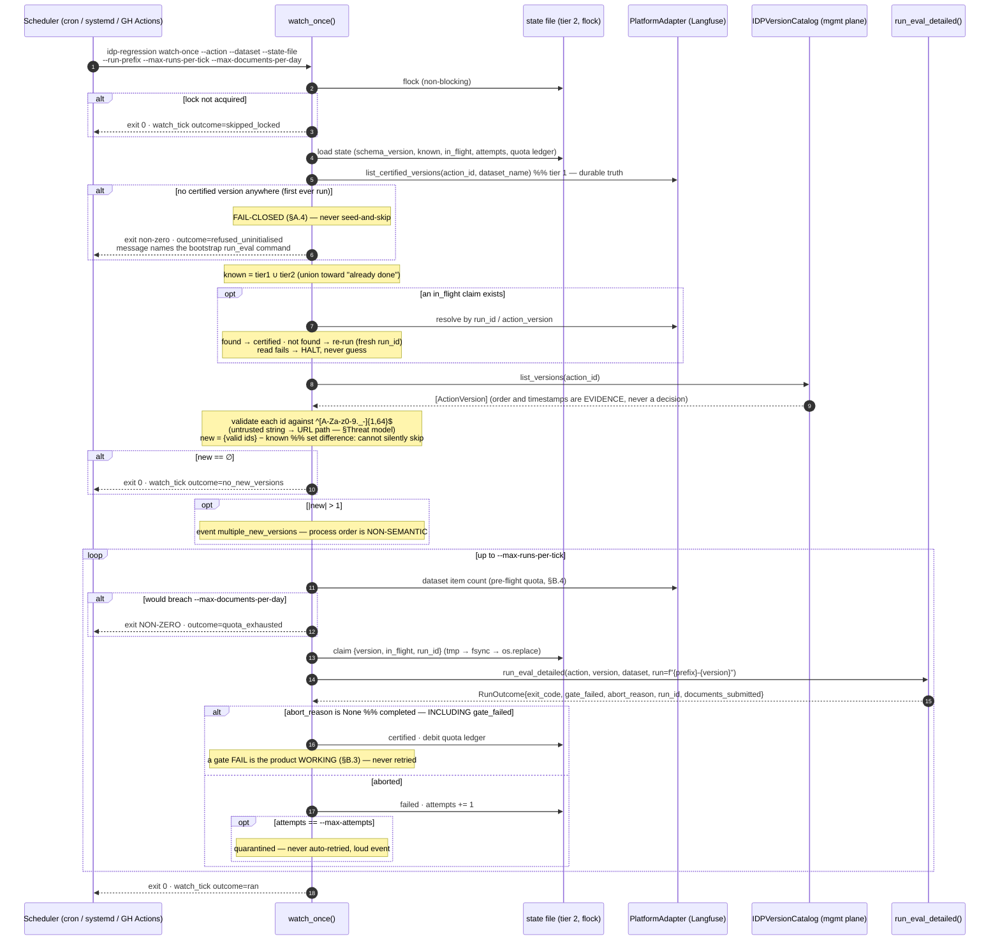

# ADR-0006: Version-change detection & unattended run triggering

**Status:** Proposed — **conditional on S-01.6 / T-01.6.6 discovery** (see §Preconditions)
**Date:** 2026-09-22
**Context (use case):** UC-01 (the run itself, unchanged) + a **new** use case, provisionally **UC-02 "unattended version watch"**, owed by Feliz. This ADR designs the capability; it does not write the use case.
**Risk:** High — this is the first component that can **spend IDP quota with no human in the loop** and the first that decides *on its own* what gets measured. Its failure modes are silence (looks healthy, certifies nothing) and runaway (certifies everything, burns the org's quota). Both are the "silently-wrong GREEN" family `CLAUDE.md ## Rigor` warns about. Atchim review: **REQUIRED** before implementation.

---

## Context

On 2026-09-22 the user stated the target architecture as a ten-step pipeline the custom app runs. Eight of the ten are already built or landing; two are genuinely absent. This ADR designs only the absent two.

| # | User's step | Status today |
|---|---|---|
| 1 | Run headless as a service | ❌ **absent** — one-shot CLI, four required flags (ADR-0004 A8) → **§Decision B** |
| 2 | Poll `GET /organizations/{orgId}/actions/{actionId}/versions` for a new published version | ❌ **absent** — no code calls it; the adapter knows only the executions path (`adapter/idp_client.py::_executions_base_url`, the **runtime** plane `idp-rt.{region}`) → **§Decision A** |
| 3 | Submit seed document(s) to the new version | ✅ `MuleSoftIDPAdapter.extract(path, action_id, version)` (ADR-0002) — the watcher supplies `version`, nothing else changes |
| 4 | Poll execution status until terminal | ✅ configurable terminal-status allowlist (ADR-0002, ASM-01) |
| 5 | Poll interval ≥ 10 s | 🔧 **landing now** in `adapter/idp_client.py` (interval floor). Not designed here. |
| 6 | Retrieve results with `?valueOnly=false` | 🔧 **landing now** in `adapter/idp_client.py`. Not designed here. **This was a live fail-shut defect**, not a cosmetic one: `normalize()` already requires the `{"value", "confidence"}` cell shape that only `valueOnly=false` returns, so every live extraction would have raised at the normalize boundary. |
| 7 | Fetch expected output from the Langfuse dataset | ✅ `PlatformAdapter.get_dataset` (ADR-0005) |
| 8 | Compare actual vs expected — per-field accuracy, version-over-version view | ✅ ours (`classifier/`) — **settled, see §Step 8** |
| 9 | Push per-field scores + gate to Langfuse | ✅ `record_run` (ADR-0005 #9) |
| 10 | Langfuse is the scoreboard / regression view | ✅ with two honest limits — **§Step 8** |

### Step 8 — where the comparison brain lives (settled 2026-09-22, recorded not re-opened)

**Langfuse stores the dataset and the scores and provides the cross-run view. The comparison itself is ours.** The nested walk, type-aware canonical matching, `match_key` list pairing and per-leaf scoring live in `classifier/` (ADR-0003) and are the CI gate (INV-08). This confirms ADR-0003/0005; it changes no code. It changes the *documentation*, because SPEC-01/UC-01/SEQ-UC-01 never said out loud which side of the seam owns the comparison, and a reader could reasonably have assumed the platform did it.

**Considered and deferred: Langfuse custom evaluators.** Langfuse supports a Python function receiving `input` / `output` / `expected_output` / `metadata` and returning `Evaluation` objects — an alternative *host* for the same custom logic. Rejected as the design, for two specific reasons, not as a general dislike:
1. It moves the pure classifier inside the platform's execution model. **INV-08 says the gate is computed in-process, before the platform write, and never inferred from what landed on the platform.** An evaluator that runs *on* Langfuse makes the platform the place the gate happens — a platform outage or an evaluator-runner bug becomes able to flip the CI signal, which is exactly what INV-08 exists to forbid.
2. It conflicts with **record-after (ADR-0005 #9)**: the orchestrator computes every gate first and writes once. A platform-hosted evaluator inverts that ordering by construction.

Keep it on the record as the alternative it is: if this product ever grows a *second*, non-gating scoring dimension (a drift metric, a human-review heuristic) that must NOT be able to affect the CI signal, a custom evaluator is the natural home for it precisely because it is outside the gate path.

**Two honest limits of "Langfuse is the regression view" (step 10):**
- **Per DEBT-18 option B, the view shows verdicts and gates, not values.** No extracted (actual), expected or confidence *value* is written to the platform. So "which field regressed, on which document, how" is answerable; "what did it extract instead" is not, from the platform alone. This is a deliberate compliance decision, not a gap.
- **Version-over-version comparison depends on run naming.** Each invocation is its own experiment (`f"{run_name}-{run_id[:8]}"`, DEBT-19/N26). For the Experiments tab to read as a *version series*, the run name must carry the version — see §Decision B, `--run-prefix`.

### Confidence (the one plausible amendment to DEBT-18 B)

The user's step-8 text mentions confidence. They were not asked to re-decide DEBT-18 and did not, **so option B stands**: no confidence value crosses to the platform. Flagged for a future decision: a **per-field confidence *score*** — a float on the existing `field:<name>` score, not the extracted value — is the one narrow amendment that is plausibly compatible with option B's intent (it reveals model certainty, not document contents). It is **not** designed here and **must not be implemented without an explicit user decision**, because a float derived per-field is still a per-field signal about a specific document, and whether that is "content" is the user's call, not the architect's.

### Preconditions — this ADR is conditional

`S-01.6 / T-01.6.6` already carries the three discovery questions this design rests on, and **none of them is answered yet**:
1. Does a management API list an action's versions, and what does it return (ids, timestamps, published/draft flag)?
2. Does submit support a floating/`latest` version?
3. Do published versions carry a timestamp or monotonic ordering?

**Decision A below is written for the "listing exists" branch and names its fallbacks explicitly.** Nothing here may be implemented before T-01.6.6 returns. Also unresolved and named in T-01.6.6: the **(a) regression gate vs (b) production monitoring** ambiguity. This ADR designs **(a)** only. **(b) is not this product** — there is no golden for an arbitrary production document, so the classifier has nothing to compare against.

---

## Threat model (new boundaries only)

The existing boundaries (IDP runtime plane, platform, local documents) are unchanged and covered by ADR-0002/0004/0005. Two are new.

**New boundary 1 — the IDP *management* plane (version listing).** A different host and a different API from the executions endpoint; its response is untrusted input.
- **Tampering / path injection (the finding worth naming).** A version id returned by the listing API flows **into a URL path** (`.../versions/{version}/executions`). Today `version` is human-supplied and validated at the CLI boundary against `^[A-Za-z0-9._-]{1,64}$` (ADR-0002). Under a watcher it is **machine-supplied from an external response** — the same class as `document_id` being golden-set content, which produced `path_containment_violation` (ADR-0004 A2). **Mitigation: the watcher applies the identical `^[A-Za-z0-9._-]{1,64}$` validation to every listed version id before it can reach a URL, and a version failing it is refused, logged (the id, sanitized) and never submitted.** A malformed id is never "skipped quietly".
- **Spoofing / elevation:** same OAuth client credentials. If the management plane requires a *different* scope or credential, that is a new Sensitive surface for Mestre to register — T-01.6.6 must report it.
- **Denial of wallet (the dominant threat, and new):** the listing response drives quota spend. A listing that returns 200 versions, or flaps, causes N×200 document extractions. **Mitigation: the quota ceiling of §Decision B is a hard precondition of this story, not an NFR to be waived** — `/signoff` blocker B-3 (N27, no quota ceiling, no config hook) is upgraded from Major-system-finding to **Done-blocker for this story**.
- **Information disclosure:** version ids and action ids are not secrets, but the listing response may carry author/description fields. Only the version id is retained; nothing else from the response is logged or persisted.

**New boundary 2 — the watcher's own persisted state.** A local file that decides whether quota is spent. Tampering with it (or losing it) causes re-runs or silent skips. Mitigations: atomic writes, an exclusive lock, and — load-bearing — **the local file is never the sole source of truth** (see §Decision A.3).

---

## Decision A — Version-change detection

### A.1 Adapter surface: a *second* Protocol, not a method on `IDPAdapter`

```python
class ActionVersion(TypedDict):
    version: str            # the opaque id that goes in the executions URL path
    published: bool | None  # None when the API does not expose it
    raw_index: int          # position in the response — recorded as evidence, NEVER used to decide

class IDPVersionCatalog(Protocol):
    def list_versions(self, action_id: str) -> list[ActionVersion]: ...
```

**Why a separate Protocol rather than widening `IDPAdapter`.** They are different planes (`idp-rt.{region}` runtime vs. the management host), different cost profiles (one cheap metadata call vs. N billable extractions), different failure semantics (a listing failure means "don't know", an extraction failure means "the run is not a reference") and different consumers (only the watcher lists; only the orchestrator extracts). Widening `IDPAdapter` would force every existing consumer and every test double to grow a method it never calls, and would put a management-plane failure inside the containment envelope ADR-0004 wrote for the runtime plane. Same rules apply to the new adapter as to the old: **typed errors from `errors.py`, no raw exception escapes, no token/credential/URL in any message** (ADR-0002).

**Pattern:** Adapter (idiomatic form: a Protocol + one concrete class, mirroring `MuleSoftIDPAdapter`) — not a new pattern, deliberately the same one, so the seam reads identically to the existing boundary.

**Fallbacks if T-01.6.6 refutes question 1 (no listing API):**
- *If floating/`latest` submit exists (question 2):* detection becomes "submit one seed document to `latest`, read back which version answered, compare to the last certified `action_version`". Cheap-ish (one extraction per tick, not N) but it **spends quota to detect**, so the tick interval must lengthen accordingly (hours, not minutes). Design impact: `IDPVersionCatalog` is implemented by a probe rather than a list; everything downstream is unchanged, which is the point of putting it behind a Protocol.
- *If neither exists:* **the capability is not feasible and we stay with CI-on-PR triggering.** Say so plainly rather than building a nightly full-run that detects with the expensive instrument what a metadata call would detect cheaply. This is the outcome T-01.6.6 exists to rule in or out.

### A.2 "A new version appeared" — decided without trusting order or timestamps

**The state is a SET of known version ids. Not a max, not a `latest` pointer, not a timestamp watermark.**

```
new_versions = {v.version for v in listed if valid(v)} - known_versions
```

Set difference is order-free and timestamp-free by construction, which is the whole requirement. `raw_index` and any timestamp the API returns are **recorded as evidence and never consulted for a decision** — an external system's ordering is not a fact we control, and a single re-ordered or back-dated response under a watermark scheme silently skips a version forever (a permanent false green). A set can only ever be wrong in the safe direction: it re-runs, it does not skip.

**A version id that fails `^[A-Za-z0-9._-]{1,64}$` is not a new version** — it is refused and alarmed (§Threat model, boundary 1).

**More than one new id in a single tick.** Each new version is independently worth regressing, so the watcher **queues all of them and processes at most `--max-runs-per-tick` per tick**, in the order the API returned them — with the order declared explicitly **non-semantic**: it is a processing order, never a claim about recency. Queue depth > 1 emits a `multiple_new_versions` event, because at a ≥ 5-minute tick it almost always means the watcher was down and an operator should know. We deliberately do **not** try to pick "the newest" — that is precisely the question we refused to answer from untrusted data.

### A.3 Where last-seen state lives — two tiers, and **not** `docs/state/`

**`docs/state/` is rejected as the home.** It is a git-tracked, human-curated narrative read by agents and people; a service writing to it many times a day produces dirty working trees and merge conflicts, its content would not survive a fresh clone in a runner, and — decisively — **it is not a store whose correctness we are willing to make quota spend and gate provenance depend on.** `docs/state/` records what happened; it is not a database.

**Tier 1 (durable truth): the platform.** INV-04 already requires every zero-exit run to record `action_id`, `action_version`, `golden_version` and `golden_dataset_name`. So *"which versions have we already certified against this dataset?"* is **already answerable from Langfuse**, survives restart, machine loss and re-clone, and needs no new store. This requires one new read seam:

```python
class PlatformAdapter(Protocol):     # additive
    def list_certified_versions(self, action_id: str, dataset_name: str) -> set[str]: ...
```

**Tier 2 (short-horizon dedup + lock): a local JSON state file at `--state-file`, outside the repo.** Tier 1 alone is insufficient for one documented reason: **Langfuse public reads lag** (`CLAUDE.md ## Langfuse facts that bite` — "never read-after-write"). A version we ran ninety seconds ago may not be visible yet, so a tick driven by tier 1 alone would re-run it. Tier 2 also carries the in-flight claim (§A.4) and the quota ledger (§B.4), and hosts the exclusive lock (§B.2).

Neither tier is redundant: **tier 1 covers "the local file is gone or forked", tier 2 covers "the platform has not caught up yet".** Those are different failures and a single store covers only one.

- Write discipline: serialize → write to `{path}.tmp` → `fsync` → `os.replace` (atomic on POSIX). Never a partial file.
- The file is **local** (not NFS — `flock` semantics, §B.2) and **outside the repository** (a `--state-file` inside the working tree is rejected at startup, the same fail-closed shape as `path_containment_violation`).
- The file contains version ids, counters and timestamps only: **no golden values, no credentials, no document ids** (INV-02).
- **Tier disagreement is resolved toward "already done":** `known = tier1 ∪ tier2`. A false "already certified" costs a delayed detection that the *next* tick catches; a false "new" costs quota immediately. Union is the cheaper direction to be wrong in.

### A.4 The very first run — **fail-closed**, not seed-and-skip

If neither tier holds a certified version for `(action_id, dataset_name)`, the watcher **refuses to start**: non-zero exit, and an error naming the exact bootstrap command to run (`run_eval --action … --version … --dataset … --run …`).

**Defence.** (i) It is the A4 empty-set argument in a new place — never proceed silently with nothing to compare against; a watcher whose first act is to certify "whatever exists" has certified nothing and established no baseline. (ii) Seed-and-skip's failure mode is the worse one: a service that looks healthy, emits ticks, and has never run a single regression — indistinguishable from a working one until the day it is trusted. (iii) The alternative to seed-and-*skip* is seed-and-*run-everything*, which on a first tick against an action with a long version history spends N × (versions) extractions of real quota with no human present. (iv) The cost of fail-closed is exactly one explicit human command, once, per action/dataset pair — and that command is the thing that makes the baseline a *deliberate* choice, which is the product's whole premise.

### A.5 Idempotency — honest about what is achievable

The unit of work is one `run_eval` for one `(action_id, version, dataset_name)`. A crash between "detected" and "recorded" must not double-run *or* silently skip.

**Claim protocol (tier 2):**
1. Before any IDP call: write `{version, status: "in_flight", claimed_at, run_id}` atomically.
2. On completion: `status: "certified"` (run completed — **including a gate FAIL**, see §B.3) or `status: "failed", attempts += 1, last_abort_reason`.
3. **On startup, an `in_flight` claim older than the run's wall-clock budget is resolved, never guessed:** query tier 1 for that `run_id` / `action_version`. Found → mark certified. Not found → re-run under a **fresh `run_id`**. **If the tier-1 read fails, the watcher halts** rather than choose — consistent with every other fail-closed decision in this system.

**What this gives, stated honestly: at-least-once, with a bounded and detectable duplicate. Not exactly-once.** Exactly-once across two systems with no shared transaction is not achievable and claiming it would be the lie. The duplicate is *harmless to correctness* — each run gets its own `run_id`, its own experiment (`{run_name}-{run_id[:8]}`), and `uuid5`-derived score ids scoped to the full `run_id`, so a re-run can never overwrite or merge another run's scores (N26). It costs quota, which is what §B.4's ceiling is for. The one thing that must never happen — a version silently never run — is prevented by the set-difference of §A.2: an unrecorded version simply stays in `new_versions` on the next tick.

---

## Decision B — Headless service mode

### B.1 Trigger model — **external scheduler invoking a one-shot tick.** Recommended.

Three options were weighed.

| Option | Pros | Cons |
|---|---|---|
| **A — long-running daemon** (own loop, own sleep) | one process; in-memory state; no scheduler dependency | re-introduces exactly the ambient-state failure mode **A8** removed: the process discovers its own action/version and outlives every reviewed file; needs its own supervision, restart, log rotation and health endpoint; a crashed daemon is silent |
| **B — external scheduler runs a one-shot tick** ✅ | the whole invocation lives in a reviewed file (cron/systemd unit/GH Actions workflow) — **so a change to what is watched is a line in a PR diff**; crash recovery is the scheduler's, already solved; overlap is a lock, not a state machine; identical operationally to the existing CLI | a scheduler must exist; per-tick process start cost (irrelevant at ≥ 5 min) |
| **C — webhook from Anypoint on publish** | near-zero latency; no polling | requires an inbound HTTP endpoint (a brand-new public trust boundary, authn/authz, replay protection) for a tool whose acceptable latency is *minutes*; and T-01.6.6 has not established that Anypoint emits such an event at all. Rejected as disproportionate — revisit only if IDP has no listing API *and* does emit publish events |

**Decision: Option B.** New subcommand — a **tick**, not a daemon:

```
idp-regression watch-once \
    --action <id> --dataset <name> --state-file <path> \
    --run-prefix <prefix> --max-runs-per-tick <n> --max-documents-per-day <n>
```

**One-line defence:** A8 ruled that what a run measures must be explicit and visible in a reviewed file, and a scheduler-invoked tick keeps every member of that set — action, dataset, run naming, state location, quota ceiling — on a command line in a versioned config, while a daemon that discovers its own parameters is the ambient-state failure mode A8 was written to delete.

**Run identity under a watcher — the one A8 exception, and why it is not a hole.** The watcher *must* discover `--version`; that is the capability. Every other flag stays **required, CLI-only, no env fallback**, exactly per A8. The exception is bounded by four properties: (i) `--version` is by definition the *regression variable* — the only member of the triple whose purpose is to change without a human; (ii) the watcher never invents a version string, it can only pass through an id the IDP listing API returned **for that exact action**; (iii) that id is validated against ADR-0002's regex before it can reach a URL path; (iv) **INV-04 is untouched** — the discovered `action_version` is recorded on the run, so "which version was this green build measured against?" is answerable after the fact exactly as before. A8's property was *auditability*, not *human authorship*, and all four preserve it.

**Tick interval: default ≥ 5 minutes, and never below 60 s.** The user's ≥ 10 s floor is about *execution status* polling inside a run (landing in `idp_client.py`) and does not apply here: a version-listing tick every 10 s is 8,640 metadata calls a day to detect an event that happens a few times a week. The gain is latency nobody needs; the cost is management-plane rate-limit exposure.

### B.2 Overlap prevention — an exclusive OS lock, not a lease

The tick takes a **non-blocking `flock` on the state file** at startup. Cannot acquire → **exit 0** with `outcome=skipped_locked`; a scheduler overlapping a long run is normal operation, not a failure, and must not page anyone.

`flock` is chosen over a lock file with a TTL for one reason: **the kernel releases it when the process dies**, so there is no stale-lease heuristic to get wrong — and a stale-lease heuristic set too short is precisely how you get two concurrent runs spending double quota. Constraint this imposes: **the state file must be on a local filesystem** (`flock` over NFS is unreliable); the startup check rejects a state file on a network mount if it can detect one, and the deployment note states it regardless.

### B.3 Failure handling across ticks

**A failed run never blocks the next tick.** But a version that failed is not marked certified, so a naive retry loop would burn quota forever on a permanently broken version.

- **Per-version attempt counter.** After `--max-attempts` (default 3) consecutive *infrastructure* failures for the same version, that version moves to `quarantined` with its last `AbortReason` and is **never retried automatically**. The watcher continues with other versions and emits a loud `version_quarantined` event. Clearing it is a deliberate human act.
- **A gate `FAIL` is a SUCCESSFUL run, and must be recorded as certified.** This is the single most important rule in this section: the product working correctly (detecting a regression) must not be mistaken for the product failing. Re-running a version that legitimately fails its gate, three times, every tick, is a quota bonfire that also buries the real signal.
- **Therefore the watcher must distinguish "gate failed" from "run aborted" — and the exit code deliberately cannot tell it** (CT-04: all non-zero, no namespace fragmentation, immutable by ADR-0004 §API contract). **So the watcher calls `run_eval` in-process and consumes a structured outcome; it does not shell out and read an exit code.** This is a second, independent reason not to build the daemon-or-subprocess shape.

**Required seam (a proposed delta to S-01.4, not an edit — §Decision C):**

```python
@dataclass(frozen=True)
class RunOutcome:
    exit_code: int
    gate_failed: bool                 # a real run that found a regression
    abort_reason: AbortReason | None  # None iff the run completed
    run_id: str
    documents_submitted: int          # for the quota ledger (§B.4)

def run_eval_detailed(...) -> RunOutcome: ...
def run_eval(...) -> int:             # unchanged thin wrapper — CT-04 untouched
    return run_eval_detailed(...).exit_code
```

`run_eval` keeps its `-> int` signature and its contract, so **CT-04, INV-06 and the CI gate are unaffected**. The watcher is a second consumer that needs more than the CI gate needs, and the correct answer to that is a richer sibling, not a fragmented exit code.

### B.4 IDP quota ceiling — a **Done-blocker**, not an NFR row to waive

`/signoff` B-3 (N27) found no quota cap and **no config hook at all**. Until now that was a Major system finding with a human in the loop. A watcher removes the human, so:

- `--max-runs-per-tick` and `--max-documents-per-day` are **required flags, no defaults** (the A6 no-default argument: a default is the mechanism by which CI and a laptop silently diverge).
- Quota is metered in **documents submitted**, not runs — a run costs `len(dataset items)` extractions.
- **Pre-flight, never mid-flight:** before starting a run the watcher computes the dataset item count and refuses to start if it would breach the remaining daily budget. Aborting a run half-way spends the quota *and* produces no reference.
- Exhaustion → **exit non-zero** with `outcome=quota_exhausted`. Not zero. A watcher that stops certifying must not look identical to a watcher with nothing to do; the scheduler's own alerting is the only thing watching, and it keys on the exit code.
- The ledger is a rolling window in the state file (tier 2), reset by wall-clock date in a **fixed, explicit timezone** (UTC — a local-time reset silently doubles the budget twice a year).

### B.5 Observability — nobody is watching the exit code

`NFR-01 Observability: REQUIRED` is per-UC and is not waived by the `prototype` profile. A background service's failure mode is *silence*, which no existing telemetry detects.

**The observability contract for the watcher:**

| Event | Emitted when | Fields |
|---|---|---|
| `watch_tick` | **every tick, unconditionally, including no-op ticks** | `action_id`, `dataset_name`, `outcome` ∈ {`no_new_versions`, `ran`, `skipped_locked`, `quota_exhausted`, `halted`, `refused_uninitialised`}, `listed_count`, `new_count`, `queue_depth`, `elapsed_seconds` (monotonic), `budget_remaining` |
| `version_detected` | a version enters `new_versions` | `version` (sanitized), `source` ∈ {`listing`, `probe`} |
| `version_refused` | a listed id fails the regex | sanitized id, reason |
| `multiple_new_versions` | queue depth > 1 | `count` |
| `version_quarantined` | attempt budget exhausted | `version`, `attempts`, `last_abort_reason` |
| `run_started` / `run_finished` | delegating to `run_eval_detailed` | `run_id`, `version`, `gate_failed`, `abort_reason`, `documents_submitted` |

Structured, one JSON object per line, through the existing `sanitize_for_log` path (INV-02: no golden value, no credential, no token, no path ever).

**The alerting contract (two rules, and the honest caveat).** The unconditional `watch_tick` line exists so that *absence* is detectable: the deployment must alarm on **(1) no `watch_tick` in N intervals** — liveness — and **(2) any `outcome` in {`halted`, `quota_exhausted`, `refused_uninitialised`} or any `version_quarantined`**.

⚠️ **Honest caveat, stated rather than buried: this repository has no alerting sink, and nothing today consumes these lines.** An observability contract nothing consumes is exactly the shape of the already-waived N11 ("the signal exists; nothing consumes it"). **The alerting sink is therefore part of this story's Definition of Ready, not a follow-up** — see §Proposed story. Shipping the emitter alone would produce a service whose designed failure-detection mechanism is a text file no one reads.

---

## Design patterns

| Component | Pattern (intent) | Stack-idiomatic form (Python — `skills/python/design-patterns.md`) |
|---|---|---|
| `IDPVersionCatalog` | **Adapter** | a `Protocol` + one concrete class, deliberately mirroring `MuleSoftIDPAdapter` so the seam reads identically |
| Version-source variation (listing vs floating-probe) | **Strategy** | two implementations of the same Protocol, selected in a factory function — **not** a class hierarchy; this is the reason the Protocol exists before T-01.6.6 answers |
| State file | **Repository** | a small module of functions over one JSON document (`load_state` / `save_state`), not an ORM and not a class — the store is one file |
| `watch_once()` | **Facade** | a module-level function over `catalog + platform + run_eval_detailed`, mirroring `run_eval` |
| Tick-outcome branching | **ad-hoc — no pattern applies** | a flat sequence of guards returning a typed outcome. Forcing a Command or State object over six mutually exclusive branches would be the over-application the skill warns about |

---

## API contract (observable behaviours — Hyrum's Law)

- `run_eval(...) -> int` and the exit-code contract (CT-04) are **unchanged and remain immutable**. The watcher's needs are served by an additive sibling.
- `watch-once` exit codes: `0` = tick completed (including `no_new_versions` and `skipped_locked`); **non-zero** = the watcher could not do its job (`halted`, `quota_exhausted`, `refused_uninitialised`, uncaught error). A gate `FAIL` inside a watched run is **exit 0 for the tick** — the tick did its job; the regression is reported through the run's own scores and the `run_finished` event. This is the one place where watcher and orchestrator exit semantics deliberately differ, and it is the difference between "the service is broken" and "the service found something".
- The state file's schema is **private** to the watcher. Nothing else may read it. Versioned by a `schema_version` key; an unrecognised version is a fail-closed halt, never a silent reset (a silent reset re-runs the entire version history).
- `list_certified_versions` returns a set and may **under**-report due to Langfuse read lag. Consumers must treat it as a lower bound; it is never authoritative for "this was NOT run".

---

## Consequences

**Positive.** Detection stops depending on a human noticing a publish. Set-difference detection cannot silently skip a version regardless of how the external API orders or timestamps its response. Tier-1 state means the durable truth about what has been certified already lives where the provenance lives (INV-04) — no new database. The scheduler-tick shape keeps A8's auditability and reuses crash recovery, supervision and log shipping that already exist.

**Negative.** At-least-once, not exactly-once — a crash in a narrow window can cost one duplicate run's quota (correctness unaffected). Two state tiers are two things that can disagree, mitigated by union-toward-already-done. Detection latency is the tick interval, minutes not seconds. The quota ceiling that this story forces (N27/B-3) is work the project has so far deferred, so this story is **more expensive than it looks** — and that is the honest price of removing the human.

**Follow-up.** UC-02 (Feliz). SPEC-02 + cards + estimates (Dunga). The `run_eval_detailed` delta against a DONE S-01.4 (§Decision C). The alerting sink. `## External services` may need a management-plane credential row — **Mestre's to write**, from T-01.6.6's answer to "does listing need a different scope?"; I have identified the dependency and am not registering it.

## Reversal cost

**Medium.** Deleting the watcher is easy — it is additive, it owns its own module, and nothing in the existing run path depends on it. Two things are not cheap to reverse: the **state-file schema** (once a fleet has state, a format change needs a migration or a full re-certification sweep) and **`list_certified_versions`** on `PlatformAdapter` (a Protocol widening that every double must implement). The *policies* — fail-closed first run, set-not-watermark, gate-FAIL-is-certified, pre-flight quota — are the load-bearing parts and reversing any of them re-introduces a specific, named failure mode rather than merely changing a mechanism.

---

## Decision C — Documentation reconciliation

**Nothing in UC-01's flow changes.** The watcher is a *new caller above* `run_eval`, not a modification of it. That is why the reconciliation is small and mostly narrative.

| Doc | Change | Who, and why |
|---|---|---|
| `docs/use-cases/UC-01-baseline-regression.md` | Actor/trigger line gains the unattended watcher as a **third** trigger (alongside Prompt Engineer and CI); a note recording the §Step 8 ownership statement | **Narrative → edited by me (2026-09-22).** No AC, flow step or BR changes |
| `docs/design/SEQ-UC-01-baseline-regression.md` | A note that the actor may be the watcher, and the §Step 8 ownership statement. **The diagram itself is unchanged** | **Narrative → edited by me.** |
| `docs/specs/SPEC-01-baseline-regression.md` §Summary/§Scope | The §Step 8 ownership sentence; "unattended version-watch triggering" named under **Out of scope → SPEC-02** | **Narrative → edited by me.** |
| `docs/specs/SPEC-01-baseline-regression.md` S-01.4 **DoD** | `run_eval_detailed` / `RunOutcome` seam (§B.3) | ⚠️ **Proposed delta for Dunga — NOT edited by me.** S-01.4 is **DONE**; adding a seam changes its Files set and stales `docs/qa/TEST-S-01.4-*.md`. Dunga's call: a new sub-task on S-01.4 with a `/test` re-stamp, or a task on the new story that touches S-01.4's module and pays the re-stamp there. **My recommendation: the latter** — the seam exists only for the watcher, so the consumer's story should carry its cost and its re-stamp |
| `docs/design/CONTRACTS.md` / `INVARIANTS.md` | No change yet. CT-06 (`IDPVersionCatalog` response contract) and CT-07 (state-file schema) land with SPEC-02, once T-01.6.6 pins the real response shape. Registering a contract against an unverified API would be inventing a seam | Deferred, deliberately |
| `docs/qa/NFR-02.md` | **Created** — the NFR checklist for the new UC | Mine. All rows `⬜ PENDING`; I set targets, I do not verify them |
| `docs/state/ASSUMPTIONS.md` | T-01.6.6's three questions become blocking assumptions of SPEC-02 | Dunga/Feliz at `/plan`, once UC-02 exists |

---

## Proposed story — **S-02.1, under a NEW spec (SPEC-02), not under SPEC-01**

**Why a new spec and not `S-01.7`.** SPEC-01 realises UC-01, whose actor is a Prompt Engineer or CI running a regression *they* decided to run. This capability has a **different actor** (an unattended service), a **different trigger** (a state change at an external system), **new persistent state**, a **new external API plane**, and post-conditions UC-01 does not have (what has been certified, what is quarantined, how much quota is left). Those are the hallmarks of a separate use case, not another story inside one. Folding it into SPEC-01 would also quietly widen a spec whose `/signoff` verdict is 🔴 NO-GO with five open blockers — SPEC-01 needs closing, not extending.

**Story (for Feliz to ratify as UC-02 and Dunga to card):**
> **As a** Prompt Engineer, **I want** the regression suite to run itself whenever a new action version is published **so that** a prompt change is judged against the golden set without anyone remembering to trigger it — and so that an unpublished-through-PR change is caught too.

**Scope in:** `IDPVersionCatalog` + concrete implementation; set-difference detection with regex validation of listed ids; two-tier state (platform `list_certified_versions` + local state file) with atomic writes and `flock`; `watch-once` CLI; claim/resolve idempotency; attempt budget + quarantine; pre-flight quota ceiling (closes N27/B-3 for the watched path); the observability contract of §B.5 **and** a consuming alerting sink; `run_eval_detailed` / `RunOutcome`.

**Scope out:** production-extraction monitoring (T-01.6.6's reading (b) — a different product); webhooks; multi-action watching (one action per tick invocation — run two schedules); any change to `classify` / `overall_gate` / the exit-code contract; per-field confidence scores (needs a user decision, §Context).

### Definition of Ready — **NOT READY.** Six conditions, all currently open.

1. **T-01.6.6 answered** (the three listing questions) and the (a)-vs-(b) ambiguity resolved in writing. Without Q1/Q2 the design's own §A.1 has an unresolved branch and the story may be **infeasible**. *Hard blocker.*
2. **UC-02 written and intent-validated by Feliz.** This ADR is a design without a use case above it; the ACs, personas and business rules are Feliz's, not mine.
3. **`/signoff` B-1 and B-2 closed** (N25 default `ENCRYPTION_KEY`, N18 the golden store on `0.0.0.0` behind `postgres`/`postgres`). *Hard blocker, and non-negotiable for this story specifically:* tier-1 state means the watcher's decision about whether to spend quota is **read from that database**. Automating on top of an unprotected, unbacked-up store multiplies its blast radius.
4. **B-5 closed — at least one real document end-to-end** (S-01.6 / DEBT-22). Automating a pipeline no document has ever traversed automates an unverified pipeline.
5. **An alerting sink chosen and available** (§B.5). Not the emitter — the consumer. Without it the service's designed failure-detection is a log file nobody reads.
6. **Estimated by Dengoso, carded by Dunga.** Unestimated → not Ready, boardless or not. My rough shape for sizing only, not an estimate: the catalog adapter and the state file are small; **the quota ceiling and the alerting sink are the expensive, under-appreciated halves.**

**Rigor.** `prototype` per `CLAUDE.md`. Two gates are **not** profile-driven and bind regardless — and this is recorded, not assumed: `Containment: REQUIRED` (this story adds a new external boundary and a new unattended failure envelope → `/harden`) and `Observability: REQUIRED` (a background service is the case observability exists for). **Risk level: high**, so per `## Rigor` a `/test` stamp is required from the SPEC header and **DEBT-44 applies — the `/test` gate may not be run by the APPROVE-issuing reviewer instance.** Any gate the profile does turn off must be recorded `skipped: prototype profile` in the QA report and the state log, never silently dropped.

---

## Appendix — the tick, as a sequence

Kept here rather than in `docs/design/SEQ-UC-02-*.md` deliberately: a SEQ file is an artefact of a use case, and UC-02 does not exist yet. It moves to its own file when Feliz writes UC-02.



## What this ADR does NOT decide (and who decides it)

1. **Whether a version-listing API exists at all** → T-01.6.6, live org. The entire capability is conditional on it.
2. **Whether per-field confidence may cross to the platform** → **user**. DEBT-18 option B stands until they say otherwise.
3. **Which scheduler** (cron / systemd timer / GitHub Actions `schedule`) → user/ops. The design requires only "something runs a command on an interval and preserves its exit code".
4. **Which alerting sink** → user/ops. The design fixes the *contract* (what is emitted, what must be alarmed on), not the product.
5. **The quota numbers** — `--max-documents-per-day`, `--max-runs-per-tick`, the tick interval → **user**, from the org's actual IDP allotment. I refuse to default them; a guessed quota ceiling is worse than none because it looks like a control.
6. **Whether the management plane needs a different credential/scope** → T-01.6.6 reports it; **Mestre** registers it in `## External services`. Not mine to write.
7. **How the `run_eval_detailed` delta is carded against a DONE S-01.4** → **Dunga** (§Decision C).
