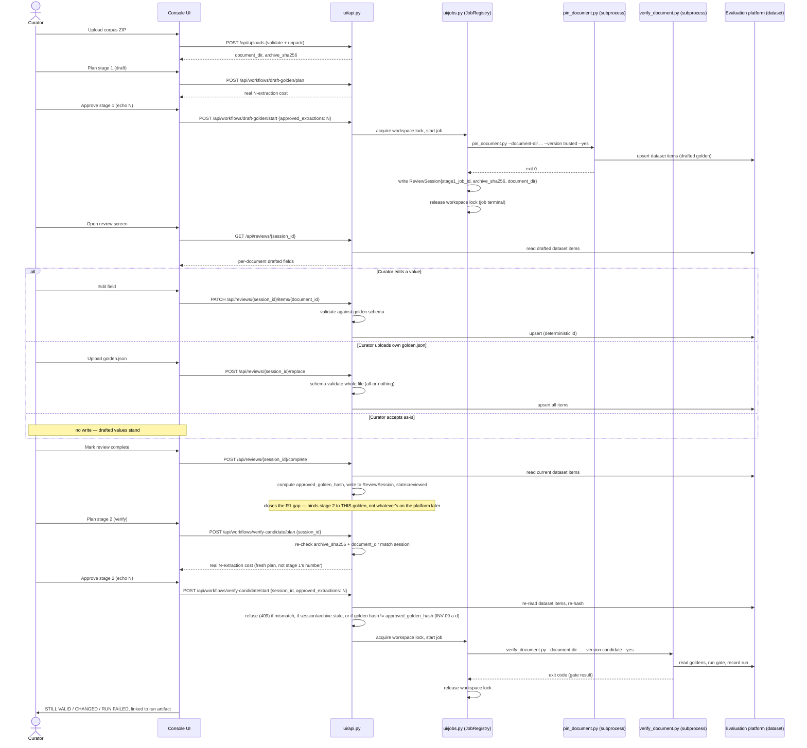

# SEQ-UC-02: Two-stage console validation with a golden review/approve gate

Notes:
- The review step (between the two `alt` blocks and the two approvals) holds **no** workspace lock and spends **no** quota — see ADR-0008 "Why does the review step hold no workspace lock?".
- `ReviewSession` (CT-06) is what lets stage 2 be started in a later console session — the diagram's gap between "release workspace lock" and "Curator opens review screen" may span a restart.
- INV-09 is enforced at the `verify-candidate/start` boundary, not earlier — a stale or tampered session is caught at the last possible moment, right before quota would be spent.
- The explicit "review complete" step and its `approved_golden_hash` capture were added after Atchim's round-1 review (R1): without it, an **accept-as-is** review writes nothing to the platform, so nothing would bind stage 2 to the specific golden the curator actually looked at — a second workspace or operator overwriting the same platform item during the pause would otherwise go undetected.
