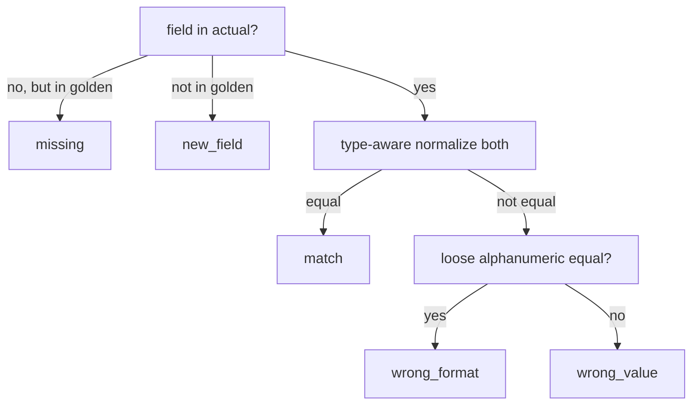

# Design inputs (seed for /design)

Architecture, candidate ADRs, and NFRs for the architect (Soneca) to turn into formal ADRs
and an NFR checklist. These are *seeds* — the decisions are made, but `/design` owns the
formal record and may refine them.

## Component architecture

```
src/idp_regression/
  adapter/        # IDP client: auth, submit, poll, normalize   (Epic A)
  classifier/     # classify() + overall_gate() — pure logic     (Epic B)
  goldens/        # golden schema, load/validate, bootstrap       (Epic C)
  platform/       # swappable Langfuse|Opik adapter               (Epic D)
  orchestration/  # push_dataset, run_eval (CLI)                  (Epic D)
  remediation/    # reads verdicts via platform API               (Epic E)
  routing/        # doc-type detection, structural novelty        (Epic F)
```

Dependency direction: `orchestration` → (`adapter`, `classifier`, `goldens`, `platform`).
`classifier` depends on nothing external. `platform` is the only module importing a platform
SDK. `remediation` and `routing` are later epics built on the same core.

## Run sequence (golden-set mode)

```
run_eval --version <v> --run <name>
  load_dotenv()
  platform = make_platform()          # Langfuse or Opik, behind one interface
  dataset  = platform.get_dataset()
  for item in dataset:
    actual   = adapter.extract(item.document_id, version=<v>)   # IDP call, once
    verdicts = classifier.classify(item.golden, actual)
    gate     = classifier.overall_gate(verdicts)
    platform.write_scores(run=<name>, item=item, verdicts=verdicts, gate=gate)
  platform.flush()
```

Baseline-diff mode swaps `item.golden` for a captured prior execution as the reference; the
classifier call is identical.

## Candidate ADRs

- **ADR-1 — Platform behind a swappable adapter.** All Langfuse/Opik SDK calls live in
  `platform/` behind one interface (`get_dataset`, `write_scores`, `flush`, golden CRUD). The
  Langfuse-vs-Opik decision stays reversible until as late as possible; the rest of the app
  never imports a platform SDK. *Consequence:* one thin adapter per platform; the app is
  written once.
- **ADR-2 — Classifier is pure and platform-agnostic.** `classify()`/`overall_gate()` take
  plain dicts and return plain dicts. No IDP, no platform, no I/O. *Consequence:* the highest-
  value logic is fully unit-testable and is the safe place to start (the spike proves it —
  11/11 tests).
- **ADR-3 — new_field / new_line are informational.** These verdicts never affect the gate.
  *Consequence:* prompts can be extended without false regressions; the gate measures *loss*,
  not *change*.
- **ADR-4 — Criticality-based gate.** FAIL only on a critical `missing`/`wrong_value`.
  Criticality is a property of the golden, owned by the curator. *Consequence:* teams tune what
  "regression" means per field without code changes.
- **ADR-5 — Type-aware normalization with a format tier.** Compare per field type; a looser
  alphanumeric normalization separates `wrong_format` from `wrong_value`. *Consequence:*
  reformatting (currency, dates, punctuation) is not a false regression.
- **ADR-6 — Line items matched by `match_key`.** Rows compared by a stable key, not position.
  *Consequence:* row reordering is not a diff; unmatched output rows are `new_line`.
- **ADR-7 — Document files stay out of the platform.** Only `document_id` + expected fields are
  stored. *Consequence:* addresses data sensitivity and platform multimodal-UI limits; the
  adapter resolves `document_id` → file at run time.
- **ADR-8 — No Docker for the custom app.** Native Python on M1 and CI; Docker only for the
  self-hosted platform server. *Consequence:* two separate deployment stories; keep them apart
  in the runbook.
- **ADR-9 (OPEN) — Langfuse vs Opik.** Decide during `/design` by scoring the substrate against
  the Curator's nested-golden editing workload. Langfuse form-mode favours non-engineer editing;
  Opik immutable versioning favours audit history. Until decided, ADR-1 keeps both viable.

## NFR seeds (for the NFR checklist)

- **Security:** secrets from env/secret store only; `load_dotenv()` before any client; golden
  contents sensitive; no document files in the platform; gitleaks in CI.
- **Reliability:** IDP poll has a timeout; a non-terminal execution surfaces as an error, not a
  silent pass; transient IDP/platform calls retried with backoff.
- **Reproducibility:** committed dependency lock; run records action version + golden version.
- **Testability:** classifier unit-tested independent of IDP/platform; adapter and platform
  integration-tested against live services separately.
- **Maintainability:** platform SDK usage confined to `platform/`; score names are a stable
  contract for the remediation UI.
- **Cost:** if Langfuse is chosen, note that it bills scores as billable units — a regression
  run emitting many scores per document compounds; account for this in run design.
- **Observability:** each run logs which documents failed, with expected/actual per failed field.

## Diagram — verdict decision (for reference)


